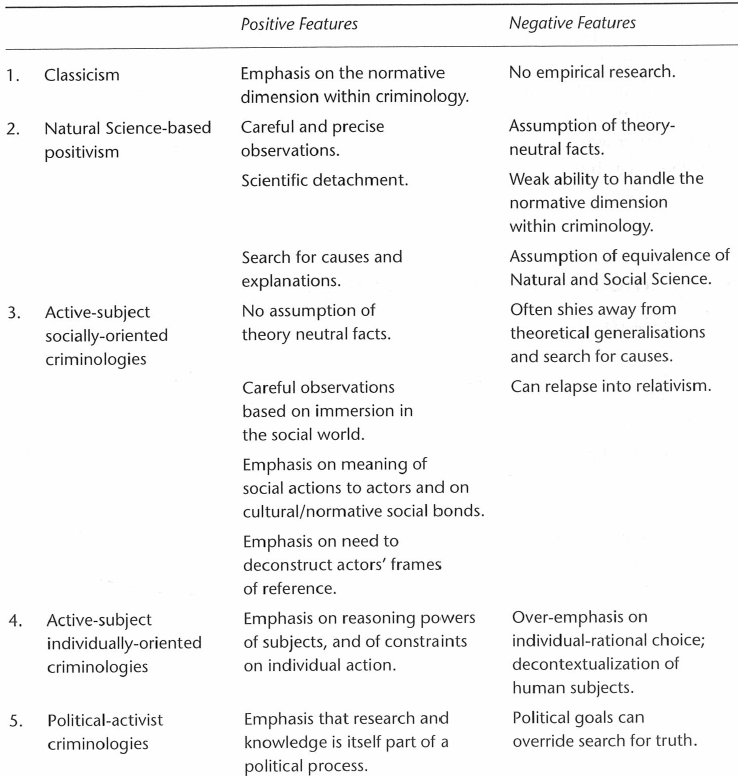
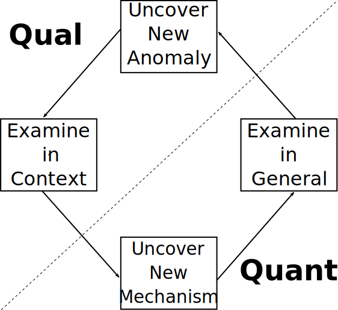
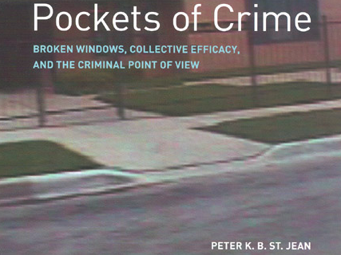
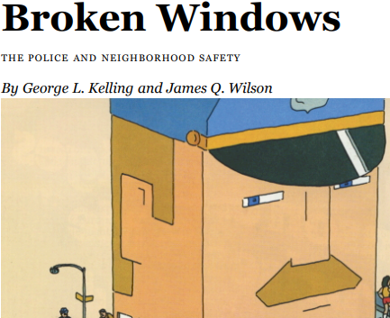
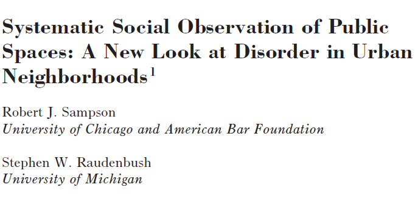

```{r setup, purl=FALSE}
#| include: false
knitr::opts_chunk$set(eval=TRUE, echo=TRUE, message=TRUE, warning=TRUE)
```


# Course Goals

* Understand what research is and how it is done

   * Major research traditions in criminology

   * Principles of research design

* Recognize major debates and challenges in criminological research

* Learn to critically evaluate research

* **Help you write a robust research proposal**

---

# This Course

Mainly **methodology**:

* Theory and process of answering **research questions**
* Necessary to design and evaluate research

--

Secondarily **methods**:

* Procedures used to generate and interpret data
* Necessary to interpret results

--

Split design:

* First half emphasizes quantitative approaches
* Second half emphasizes qualitative approaches

--

&#8203;Materials: [clanfear.github.io/ioc_crm/]()

   * Lecture slides and readings (some on Moodle)
   * Recordings posted on once available

---

# Other Courses

* Introduction to Quantitative Analysis (IQA)

   * Using quantitative methods
      * Statistical estimation
      * Data programming
      * Visualization
   * Closely follows this course

--

* Lent:

   * Using methods
   * Practical workshops
   * Topics to be decided (requests welcome!)
   * Likely to lean qualitative

---
class: inverse

# Criminological Research

&nbsp;


---


# Joining a conversation

Criminology is an ongoing conversation

--

To contribute to the conversation, you need to know:

* What the conversation is about
* What the current state is
* What its premises are

--

This requires understanding of **theory** and **methodology**

--

These lead us to:

* Ask good **research questions**
* Develop good **research designs** to answer them

---

# Good Research Questions

What makes a research question *good*?

--

* It is empirically answerable<sup>1</sup>

   * It is in some sense factual
   * It is identifiable *in principle*

.footnote[[1] What answerable *means* is subject to epistemological debate.]

--

* It improves our understanding of the world (i.e., it informs **theory**)

   * An answer would change how we think or behave
   * An answer would solve a significant problem

--

&nbsp;

.text-center[
*These are subjective; research questions require **justification***
]

---

# Sources of Questions

* Theory

   * We have expectations—are they correct?
   * Often theories offer differing expectations
      * Adjudication makes for compelling questions!

--

* Ignorance

   * We have no expectations
   * True scientific ignorance is rare<sup>1</sup>
      * Usually: "is $x$ like $y$?"
      * Almost never: "nothing is like $x$"

.footnote[[1] Criminology, like other social sciences, is plagued with reinvention of the wheel, partly due to rewarding (the appearance of) novelty.]

--

.text-center[
*In either case, you're probably going to need to read a lot.*
]

---

# Sources of Research

.pull-left[
Academic Researchers

Contract Researchers

* RTI International

Government and Related Orgs

* Ministry of Justice
* Home Office
* Youth Justice Board
* Inspectorates

Campaign Organisations

* Prison Reform Trust
* Howard League for Penal Reform
]

--

.pull-right[
Agendas influence research

* What to research
* How to research
* How to interpret

*This includes academics*
]

---

# What is Generated?

Descriptions

* Patterns and prevalences
* Descriptive narratives

--

Associations and Interpretations

* Risk and protective factors
* Interpretive narratives

--

Explanations / Explanatory Frameworks

* Theory
* Theory testing and causal research 

--

Evaluations and Critiques

* Tests of policy and interventions
* Normative critique or advocacy

---

# Crime as a Subject

Garland (2002:23):

> Expert, research-based knowledge about crime and criminals
still competes with views of the subject which are not
‘criminological’ in their style of reasoning or their use of
evidence. Judges, moralists, religious fundamentalists, and
populist leader-writers still offer views on criminological
subjects which are quite innocent of criminological science.
Unlike physics or even economics, which have established a
degree of monopoly over the right to speak authoritatively
about their subjects, criminology operates in a culture which
combines traditional and scientific modes of thought and
action. Intuitive, ‘instinctive’, common-sense views about
crime and criminals are still more persuasive to many –
including many in positions of power and authority – than
are the results of carefully executed empirical research’


???

Unlike many disciplines, there's both a lot of interest and no monopoly on authority

Have to engage with political and moral views of public

Deterrence example: Science says harsh punishment doesn't do much, but public and politicians go to it and it is popular to do so

---

# Criminological Topics

* Offending (e.g., opportunity)

   * Incidence and distribution of criminal behaviour
   * Causes or correlates of criminal conduct
   * Ethnographies of deviant groups

--

* Consequences of crime (e.g., victimizaton)

   * Victim studies
   * Effects on physical and mental well-being

--

* Responses to crime (e.g., policing and incarceration)

   * Penological studies
   * Monitoring and evaluation of criminal justice
   * Criminal law<sup>1</sup>


.footnote[[1] Importantly *defines* what is crime in legal terms]

---

# Research Design

**Research design** is *strategy* for answering a question:

* What data are needed
* How to obtain those data
* How to analyze data
* How to interpret results

--

Good **research design** is that which can answer your (good) research question

--

There are many different types of research

--

Your choice should be determined by your *question*

---

# Types of Research

* Description (‘what does this look like?’):

   * How do crime rates differ across neighbourhoods?
   * How does exposure to violence vary over the life course?

--

* Exploration / Interpretation (‘what is going on here?)

   * How do residents feel about crime in their neighbourhoods?
   * Are children exposure to violence likely to have other negative experiences and outcomes?

--

* Explanation (‘what explains or accounts for?’)

   * Do strong interpersonal networks reduce neighbourhood crime?
   * Does childhood victimization increase youth weapon carrying?

--

* Evaluation (‘what works?’)

   * Does creating a neighbourhood organization reduce crime?
   * Does a youth violence reduction program reduce weapon carrying?

---

# Descriptive

Many different forms of description

--

* Extents or prevalences

   * How many prisoners have mental health problems?
   * How many probation staff say that their morale is affected by having to fulfil targets?

--

* Processes

   * What are the dynamics of court cases? Who does what, at what point?
   * How does a youth become a gang member?

--

* Experiences

   * How do incarcerated women experience reintegration?
   * How do crime victims feel about testifying in court?

---

# Exploratory / Interpretive

* Building insight into phenomenon with limited existing data

--

* Few expectations about what you might find

   * No ‘hypotheses’
   * Broad questions

--

* Often similar to descriptive research, but searching for:

   * Understanding
   * Meaning
   * Potential explanations

--

* Often used to develop research questions for explanatory research

---

# Explanatory Research

* Why does a phenomenon occur?

* What is the result of a phenomenon?

--

* Deductive

   * Start with a theory
   * Collect data to test it
   * i.e., hypothetico-inductive model

--

* Inductive

   * Start collecting data
   * Develop theory from data
   * e.g., grounded theory

--

.text-center[
*The quantitative half of this course focuses heavily on explanatory research*
]

---

# Evaluation Research

* Is this intervention or policy *effective*?

--

* Even if you can answer this question, you still might not be able to explain *why*
   
   * Data may not be collected on what turns out to be important *later*
   
   * E.g. Minneapolis Domestic Violence Experiment
      * Arrest worked in reducing domestic violence
      * Replication studies found mixed results
      * Research design doesn't reveal *why*

--

* Explanatory research often done after or during evaluation research

   * Interviews and observations (e.g., mechanism examinations)
   * Secondary data analysis (e.g., heterogeneity tests)

---

# On Research and Theory

> Theory is never completely isolated from problems of empirical research, any more than empirical research is free from theoretical assumptions (Layder 1994:vi)

> Theory is inextricably involved in the process of data-gathering and data-interpretation (Bottoms 2007:75)

--

*There is no atheoretical research*

--

Research makes assumptions about:

* What is worth studying
* What questions to ask
* How to measure
* How to analyze
* What counts as evidence


---



???

Strengths or limitations aren't about validity; recognition what they do and what they do not do

Divides are not clean here---these are ideal types

Don't pigeonhole yourself into a category

Also recognize that researchers from very different approaches aren't *wrong*, they have different perspectives

---

# Research Approaches


```{r, echo=FALSE, message = FALSE, warning = FALSE}
library(tidyverse)
library(knitr)
tribble(
  ~ `Paradigm`,
  ~ `Methodology`,
  ~ `Methods`,
  "View of the world and social life within it", "Strategy or plan of action", "Techniques for collecting and analysing data",
"Post-positivism<br>Interpretivism<br>Constructivism<br>Feminism<br>Postmodernism<br>Pragmatism",
"Ethnography<br>Grounded Theory<br>Action Research<br>Experiments<br>Case Studies<br>Oral History",
"Interviews<br>Focus Groups<br>Observation<br>Documentary Analysis<br>Questionnaires<br>Regression"
) |> kable()
```

.footnote[**Paradigm** here is *metatheory* or scientific philosophy; related to epistemology]


---
class: inverse

# Qualitative and Quantitative Research Methodologies

### Distinct but complementary

&nbsp;



---

# Quantitative Methodology

* Has philosophical roots in positivism (and post-positivism) and the natural sciences

--

* Distinction between scientific issues and normative ones

--

* Emphasis on:

   * Enumeration
   * Explanation
   * Prediction
   * Intervention

--

* Interest in 'laws', patterns, generalisations

--

* Hypothetico-deductive framework

   * Derive hypotheses from theory
   * Test hypotheses using data

---

# Quantitative Methods

.pull-left[
Examples

* Survey data analysis

* Experiments and quasi-experiments

* Psychometrics

* Text mining

* Meta-analyses
]
.pull-right[

]

---

# Qualitative Methodology

* Rooted in a broadly interpretivist and constructivist positions

--

* Emphasis on interpretation, e.g.:

   * How reality is understood and constructed
   * How power is exercised

--

* Interest contextual understandings

   * Prioritizes meanings over measurement and prediction

--

* Inductive and deductive analysis

   * Flexible and adaptive methods of data generation
   
---

# Qualitative Methods

.pull-left[
Examples

* Interviews

* Ethnography and participant observation

* Focus groups

* Document and discourse analysis

* Case studies
]
.pull-right[

]

---

# Mixed Methods Research

> Research in which the investigator collects and analyses
data, integrates the findings, and draws inferences using
both qualitative and quantitative approaches or methods
in a single study or program of inquiry’ (Tashakkori and
Creswell 2007:4)

--

.pull-left[
* Intellectual and practical synthesis

* Common in applied research

* Qualitative data analysis helps:

   * Make sense of observations or statistical data
   * Guide the formulation of hypotheses to be tested

]

.pull-right[

]


---

# A Methodological Toolbox

Some *specialization* is beneficial, even necessary

--

But overspecialization is limiting, both *intellectually* and *professionally*

--

It is important to be able to:

* Interpret findings of any kind

* Collaborate with others with different specialties

* Critique research using any approach

* View projects from alternative perspectives


---
class: inverse
# Research Quality

---

# Research Questions

* What are the key research questions/ hypotheses?

--

* How well are they justified? 

   * Do they respond to gaps theory or evidence?
   * Do they improve our ability to do research?
   * Do they inform policy or practice?

--

* How clearly are the key concepts /constructs defined? Are they convincing?

--

* How will the research contribute to existing knowledge?

   * How effectively does it draw on previous research findings?
   * How does it reference existing academic debates?

---

# The Research Design

* Is the research design explained and justified?

   * Is it described in sufficient detail?
   * Does it reference established standards?

--

* Does it allow the research questions or hypotheses to be answered effectively?

   * Do the methods match the questions?

---

# Data Sampling

How was the sample selected and recruited?

--

What is the make-up of the actual sample?

* Does it reflect the intended sample?
* Are limitations of the sample acknowledged?

--

Does the sample reflect the research question or hypotheses?

* Can results obtained from this sample answer the question?

---

# Data Collection

Can this generate data to answer the research questions?

--

Is this approach better than alternative approaches?

* Do the strengths justify the approach?
* Are the limitations explained?

--

How valid is their measurement strategy?

* Do the measurements capture what is intended?
* Do they refer to existing measurement standards?
* Do they address limitations?

---

# Mixed Methods Studies

Is there a convincing justification for a mixed methods approach?

* Are both qualitative and quantitative evidence needed to answer the question?
* Do the approaches complement each other?
   * Does one method compensate for limitations of the other?

--

How well has the design been explained?

* How are sampling, data collection and analysis explained?
* Do they complement each other?
* How effectively have the methods been integrated?

---

# Ethics

Is there a discussion of ethical issues?

--

Any concerns about informed consent?

--

Has any potential for harm to participants been acknowledged or addressed?

--

Reference to ethical standards/guidelines?

---

# Data Analysis

How have the data been analysed?

* Are the methods established?
* If the approach is unusual, is it justified?

--

Are the processes described fully? 

* Are they convincingly rigorous?
* Are they **reproducible**?
* Is it clear how results were derived from the data?

--

Do they make suitable use of the data collected?

* Is the examination as thorough as is warranted by the design?
* Are they attempting to do more than is possible with the data?

---

# Research Findings

.pull-left[

### Quantitative Research

Are they **valid**—measuring what was intended?

Are the findings **reliable**?

* If methods are followed again, would the results be the same?

Are they **generalisable**?

* To what extent can the findings applicable across other populations?
]

.pull-right[

### Qualitative Research

Are they **credible** (believable)?

Are the findings **dependable**?

* Would results be repeated provided the same participants, coders, and context?

Are they **transferable**?

* To what extent can the findings be applied to other situations?
]

---

# Research Conclusions

* Are the conclusions justifiable in light of the research findings?

--

* Do they answer the research questions?

--

* Are other conclusions possible/considered?

--

* Are claims to generalisability appropriate?

--

* Are there any stakeholder interests that may have shaped the conclusions of the research?

---

# Have a Chat


---
class: inverse

# Causality

---
# Causality

Scientific *theories* are *explanations* (beliefs) about how the world works

* $y$ occurs because $x$

--

Quantitative half of this course emphasizes **causality**

* Does $x$ make $y$ happen
* If we do $x$ what happens to $y$?

--

Causal approaches usually follow **hypothetico-deductive** framework

--

Causality isn't necessarily about numbers, nor factors that are physical, behavioural, or even *directly* observable:

   * *Meanings* can be cause actions
   * Experiences can cause *meanings*

???

My own theoretical work drags routine activity and ecological theories kicking and screaming into what Bottoms calls active-subject socially-oriented criminology—but my approach is generally quantitative.

--

.text-center[
*Let's start with an example*
]

---

# Broken Windows


An Observation: Serious crime is more common in neighbourhoods with disorder, such as litter, panhandlers, and loitering youth

--

The Boken Windows Thesis:

.pull-left-60[
* Offenders interpret disorder as a sign of low social control

   * If no one stops littering or pan-handling, no one will stop robbery or drug dealing
   
* Offenders are thus more likely to commit crime
]

.pull-right-40[

]

--

.text-center[
A Proposition: At the neighbourhood level, disorder *causes* crime
]

--

.text-center[
*How might we test this?*
]

---

# An Experiment

Keizer et al. (2008): Does seeing disorder make individuals more likely to commit a crime?

--

.pull-left-60[

* Leave a money-filled envelope dangling from a postbox

* Record whether passersby mail or steal the envelope

* Add litter or graffiti and repeat

* Compare rates of theft

]
.pull-right-40[

]

--

.text-center[
Theft was twice as common with either litter or graffiti.<sup>1</sup>
]

.footnote[See [Lanfear (2018)](https://digital.lib.washington.edu/researchworks/handle/1773/40974) and [Wicherts & Bakker (2013)](https://doi.org/10.1177/1368430213502) for counterpoints]

--

.text-center[
*Interpreted as evidence for the broken windows thesis*
]

---
# Observational

Sampson & Raudenbush (1999): What if low social control causes both disorder and crime?

--

.pull-left[
* Measure disorder and social control in 80 Chicago neighborhoods

* Test if disorder predicts crime when social control is *held constant*<sup>1</sup>
]
.pull-right[

]

.footnote[[1] We'll learn about holding things constant soon!]

--

.text-center[
No effect of disorder on crime once accounting for social control
]

--

.text-center[
*Interpreted as evidence against the broken windows thesis*
]

---
# Interviews

Broken windows thesis says offenders **interpret** disorder as a sign of low social control.

--

.pull-left-60[
St. Jean (2007):

* Ask robbers and drug dealers how they interpret disorder (and social control)

* Ask why they choose particular locations for crime
]
.pull-right-40[

]

--

.text-center[
Offenders don't care about disorder, they care about **opportunity**, of which social control is *only one factor*
]

--

.text-center[
*Interpreted as evidence against the broken windows thesis and a **complication** of social control*
]

---
# Wrap-Up

Readings for next week:

* Focused on quantitative data and relationships
* Building up to causal thinking
* There's a lot—get started early!