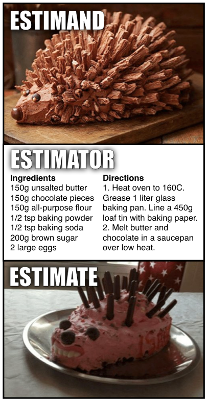

```{r setup, include=FALSE}
knitr::opts_chunk$set(echo=FALSE, warning = FALSE, message = FALSE, dev = "svg", fig.height = 5, dev.args=list(bg="transparent"))
standardize <- function(x){
  return((x-mean(x))/sd(x))
}
library(tidyverse)
library(ggpmisc)
library(janitor)
set.seed(7)
communities_orig <- read_csv("https://clanfear.github.io/ioc_iqa/_data/communities.csv") |>
  mutate(control = 0.5*standardize(crime_rate) - 0.1*standardize(pop_density) + rnorm(n()))
communities <- communities_orig |>
  janitor::clean_names(case = "title")
```


# Today


* Regression and Models

* Inferential Statistics

   * Hypothesis Testing
   * Theoretical Distributions
   * Properties of Means
   * Problems with Hypothesis Testing

* Many wordy slides

---
class: inverse

# Regression

---

# Correlations

Correlation ( $R$ ) summarizes relationship between continuous variables

--

$R$ values:

* Range from -1 to 1
* 0 indicates variables are *unrelated*
* Can be squared to obtain **coefficient of determination**: $R^2$

--

$R^2$ indicates the *proportion* of variation in one variable explained by another

--

$R^2$ values:

* Range from 0 to 1
* 0 indicates unrelated
* 1 indicates perfect relationship

--

.text-center[
*A correlation of 0.5 between $x$ and $y$ indicates 25% of the variation in $y$ is explained by $x$ (and vice versa)*
]

---

# Visualizing Correlations

```{r}
make_sample <- function(r, n){
  sig <- matrix(c(1,r,r,1),2,2)
  dat <- setNames(data.frame(MASS::mvrnorm(n=n, c(0,0), sig, empirical=TRUE)), c("x", "y"))
  return(dat)
  }
r_seq <- round(c(seq(0, 0.9, by = .15), 0.95, 1),2)

r_df <- map_dfr(setNames(r_seq, r_seq), ~ make_sample(., 100), .id = "R")
r_df$R <- factor(r_df$R, levels = r_seq)
ggplot(r_df, aes(x = x, y =y)) + 
  geom_point() + 
  facet_wrap(~R) + 
  theme_void(base_size = 16) +
  theme(panel.background = element_rect(fill='transparent', color=NA), 
    plot.background = element_rect(fill='transparent', color=NA))

```


---

# Last Week's Correlation

```{r, fig.height = 3}
communities %>%
  ggplot(aes(x = `Pop Density`, y = `Crime Rate`)) + 
  geom_point(alpha = 0.5) +
  xlab("Population Density") +
  stat_correlation(size = 5) +
  theme_minimal(base_size = 16)
```

This is a strong relationship: About 66% of the variation is explained

--

.pull-left[
But what is the *substantive* interpretation?
]

--

.pull-right[
If pop density is 20, what do we expect crime to be?
]

--

.text-center[
*What we want is a **model** to estimate how pop density predicts crime*
]

---
class: inverse

# Models

---

# The DGP

When doing research, we're usually interested in saying something about how some part of the real world works

--

The distributions of data we observe are the result of a real-world process we cannot directly observe

--

We call this the **data generating process** (DGP)

--

**Models** aim to approximate this data generating process mathematically to allow us to make quantitative statements about how the world works

--

Most of the time, in any given project, we're really interested in an **estimate** of just one part of the DGP or one characteristic of the population

* A distribution or measure of central tendency
* A correlation or other association
* A *causal effect*<sup>1</sup>

.footnote[
More on this next week!
]

---

# Estimation

Going from observed data to some kind of estimate is a process involving three components:

* **Estimand**: the real-world quantity we want to measure

* **Estimate**: the measured quantity approximating our estimand

* **Estimator**: the procedure we use to calculate the estimate using data

--

Any given estimate consists also of three components:

$$Estimate = Estimand + Bias + Noise$$

--

**Noise** comes from *randomness* in the real world or sampling

* We'll talk about this today

--

**Bias** comes from *using the wrong estimator*

* We'll mainly talk about this next week

---



.footnote[
Credit: [Richard McElreath](https://twitter.com/rlmcelreath/status/1582368904529137672)
]

---

# Regression

Regression is an estimation method for *fitting lines* to data

--

Regression is just a way to summarize a relationship between variables using a line<sup>1</sup>

* e.g., predicting $Y$ using $X$

--

* The variable being predicted is the **dependent** or **outcome** variable

* The variables used for prediction are **independent** or **explanatory** variables, sometimes called **covariates** or **regressors**<sup>1</sup>

.footnote[[1] So many synonyms!]

--

The regression line describes the **conditional expectation** of the dependent variable

* e.g., the expected value (mean) of $Y$ for different values of $X$

---

# A Regression Line

```{r}
communities %>%
  ggplot(aes(x = `Pop Density`, y = `Crime Rate`)) + 
  geom_point(alpha = 0.5) +
  xlab("Population Density") +
  geom_smooth(method = "lm", se = FALSE, formula = "y ~ x") +
  theme_minimal(base_size = 16)
```

---

# Model Fitting

The regression line represents an **estimate** of the association between population density and the crime rate (the estimand we want)

--

The estimator used for **fitting** this line has two parts:

1. The model—this is the shape of the line (e.g., straight) and our choice of covariates

2. The estimation method—the maths to fit that shape to the data, e.g., **ordinary least squares** (OLS)

--

OLS draws a line through the data that minimizes the *sum of squared residuals*

* Residuals are the $Y$ distances between the line and each point
* OLS draws the line where the sum of squared residuals is *smallest*

---

# Residuals

```{r}
form <- y ~ x
communities %>%
  ggplot(aes(x = `Pop Density`, y = `Crime Rate`)) + 
  xlab("Population Density") +
  stat_fit_deviations(formula = form, color = "red") +
  geom_point(alpha = 0.5) +
  stat_poly_line(formula = form, se = FALSE) +
  theme_minimal(base_size = 16)
```

.footnote[
[See here for an interactive explanation](https://setosa.io/ev/ordinary-least-squares-regression/)
]

---

# Regression Equation

Regression lines are defined by **parameters**: the **intercept** and **slope(s)** .

--

Regression line equations look like this:


$$y_i = a + bx_i + e_i$$

--

$a$ is the **intercept**

* The expected value of $y$ when $x = 0$

--

$b$ is a **slope**

* The amount the expected value of $y$ rises for every 1 unit increase in $x$

--

$e_i$ is the **residual**

* The difference between prediction ( $a + bx$ ) and *each value* of $y$
* The square of this is what OLS is trying to minimize

---

# Regression Equation 

```{r}
form <- y ~ x
communities %>%
  ggplot(aes(x = `Pop Density`, y = `Crime Rate`)) + 
  geom_point(alpha = 0.5) +
  xlab("Population Density") +
  stat_poly_line(formula = form, se = FALSE) +
  stat_poly_eq(formula = form, mapping = use_label("eq"), eq.x.rhs = "PopDensity", eq.with.lhs= "CrimeRate~`=`~", size = 5) +
  theme_minimal(base_size = 16)
```

---

# Predictions

You can think of the regression line as being a set of predictions of $Y$ for every value of $X$

--

The regression formula—the intercept and coefficient(s)—tells us what those predictions are

--

$$CrimeRate = -20.8 + 3.09 PopDensity$$

We expect $CrimeRate$ to be 3.09 higher for every additional unit of $PopDensity$

When $PopDensity$ is zero, the expected $CrimeRate$ is -20.8

--

If $PopDensity$ is 20, then we expect $CrimeRate$ to be:

$$41 = -20.8 + 3.09*20$$

--

.text-center[
*The next question is whether this strong association likely holds in the population*
]

---
class: inverse

# Inferential Statistics

---

# Null Hypothesis Testing

Recall that we want to learn about the true data generating process (DGP)

--

We cannot observe it directly, but we can use data to infer things about it

--

**Hypothesis** testing is one approach to learning about DGPs

--

The basic idea:

* Make an informed guess—a **hypothesis**—about what the DGP looks like
* Test if it is likely observed data were created by the hypothetical DGP
* If it seems unlikely, we **reject** our hypothesis

--

In short, we get closer to the truth by rejecting false explanations

* *via negativa*: Knowledge by subtracting what is wrong

---

# Significance Testing

The simplest hypothesis testing is **null hypothesis significance testing**

--

Process:

1. State hypotheses about estimand:

   * Null Hypothesis: There is no relationship
   * Alternative Hypothesis: There is a relationship

--

2. Make an estimate

--

3. Test how likely this estimate would be if our null hypothesis is true

   * This requires choosing a threshold for what we consider "unlikely"
   * e.g., less than 5% chance

--

4. Either reject or fail to reject the null; we do not *accept* the null

--

.text-center[
*When we reject the null, we're confident our result is not just due to **noise***
]

---

# Frequentism

Hypothesis testing is rooted in the **frequentist** paradigm of statistics

--

Frequentism is based on the logic of *infinite* random sampling

--

* For a given DGP, imagine randomly sampling from the population *forever*

--

* The distribution of values in the samples (e.g., the means) will follow a known **theoretical distribution**

   * i.e., we know how likely it is to obtain any particular estimate *if the theoretical DGP is true*

--

* Based on these theoretical distributions, we assess how (un)likely observed results are under a given hypothesis

--

* Importantly, *all of these rely on properties of random sampling*

   * Non-random samples lead to **bias**

---
class: inverse

# Theoretical Distributions

---

# Coin Flipping

In theory, a normal coin is equally likely to land on heads or tails

If we flipped it 20 times and got 13 heads, would we think it is a fair coin?

--

What about 15 heads?

--

If the coin is truly fair, it should have a 0.5 probability of coming up heads

* Our null hypothesis is the coin is fair and has a heads probability of 0.5
* Our alternative is that it is *unfair*—likely to give either more or fewer heads than 0.5

--

We can calculate how likely it is to observe any particular number of heads flips if our null hypothesis is true

* e.g., how likely is it to get 15 heads on 20 flips with a fair coin
* We can do this just by tabulating every possible outcome of 20 coin flips


---

# Binomial Distribution

If we flip a fair coin 20 times, the binomial distribution says we're this likely to see each count of heads:

```{r, fig.height = 4}
draws <- tibble(Heads = 0:20,
                Probability = map_dbl(Heads, ~dbinom(., 20, 0.5)),
                `95%` = map_dbl(Heads, ~binom.test(., 20, 0.5, alternative = "two.sided")$p.value) < 0.05)

ggplot(draws, aes(x = Heads, y = Probability, fill = `95%`)) + 
  geom_col() + 
  scale_x_continuous(breaks = 0:20) +
  theme_minimal() +
  theme(legend.position = "none")
```

Roughly 95% of the time, we'd expect to see between 6 and 14 heads.

---

# p-values

The **p-value** is the probability of observing a result at least as extreme as our estimate if the null hypothesis (a fair coin) were true.

--

* The p-value for 15 out of 20 (75%) flips being heads is `r round(binom.test(15, 20, 0.5, alternative = "two.sided")$p.value,3)`
* A fair coin would give us a result as far from 50% as this 1 in 25 times
* p-values are typically calculated using a **test statistic** derived from a theoretical distribution (e.g., $t$ or $\chi^2$ tests)

--

The *p-value* is *not* the probability our null hypothesis is true

--

All a p-value tells us is how *frequently* the theoretical distribution we chose would generate the data we observe

* p-values are only valid if we've chosen the right theoretical distribution

--

Below $\alpha=.05$ is often taken to indicate a "significant" p-value

* That is, the point at which we are *confident* we can reject the null distribution as a source of our data

---

# Errors

$\alpha$ is the rejection threshold, corresponding to a **confidence level** of $1-\alpha$

* e.g., 95% confidence corresponds to $\alpha=.05$

--

$\alpha$ indicates our "comfort" in rejecting the null when it is *true*

* e.g., $\alpha=.05$ means we reject a true null 5% of the time

--

Lower confidence levels lead to more **false positive** or **Type I error**

* Rejecting the null when it is true

--

Higher levels of confidence reduce false positives, but lead to more **false negatives** or **Type II errors**

* Failing to reject the null when it is false

--

.text-center[
*Choice of confidence levels is context-specific*
]

---
class: inverse

# Focusing on Means

---

# Means

When we want to infer something about the population from a sample, we often focus on some kind of mean

--

This is because means have a useful sampling property, described by the **central limit theorem**:

--

*No matter what the distribution of the population you sample from, the distribution of the **means** of all samples will be normally distributed around the population mean*<sup>1</sup>

.footnote[[1] Assuming the real distribution has a finite mean and variance and at least a modest sample size]

--

&nbsp;

.text-center[
*This sounds weird because it is weird*

*It makes slightly more sense visually*
]


---

# Illustration

Imagine this is the distribution of a variable in the population

```{r, cache = TRUE}
unif_draws <- runif(100000, 0, 10)
unif_mean_draws <- map_dbl(1:100000, ~mean(sample(unif_draws, 100)))
norm_draws <- c(rnorm(10000, 10, 1), rnorm(10000, 25, 4))
norm_mean_draws <- map_dbl(1:100000, ~mean(sample(norm_draws, 100)))
```

```{r, fig.height = 4}
tibble(unif_draws) |>
  ggplot(aes(x = unif_draws)) + 
  geom_histogram(bins = 50, fill = "black") + 
  theme_void() +
  geom_vline(aes(xintercept = mean(unif_draws)), color = "red") +
  theme(axis.text.x = element_text())
```

The mean is in red, but the shape is definitely not a bell curve

---

# One Sample

Let's say we sample 100 observations from it and take the mean

```{r, fig.height = 4}
tibble(unif_draws = sample(unif_draws, 100)) |>
  ggplot(aes(x = unif_draws)) + 
  geom_histogram(bins = 50, fill = "black") + 
  theme_void() +
  geom_vline(aes(xintercept = mean(unif_draws)), color = "red") +
  theme(axis.text.x = element_text())
```

Our estimate isn't bad! But if we couldn't compare to the population, how would we know that?

---

# Many Samples

If we take a ton of samples (n=100 each) and calculate all their means, their distribution looks like this—most are pretty accurate!

```{r, fig.height = 4}

tibble(unif_mean_draws) |>
  ggplot(aes(x = unif_mean_draws)) + 
  geom_histogram(bins = 50, fill = "black") + 
  geom_vline(aes(xintercept = mean(unif_mean_draws)), color = "red")  +
  theme_void() +
  theme(axis.text.x = element_text())
```

--

.text-center[
*Okay, sure, but what about **weird** distributions?*
]

---

# wat

Okay, look at this monster:

```{r, fig.height = 4}
tibble(norm_draws) |>
  ggplot(aes(x = norm_draws)) + 
  geom_histogram(bins = 50, fill = "black") + 
  theme_void() +
  geom_vline(aes(xintercept = mean(norm_draws)), color = "red") +
  theme(axis.text.x = element_text())
```

There's barely any data near the mean at all!

---

# Huh, okay

This is the sampling distribution of the means we get from *that*

```{r, fig.height = 4}

tibble(norm_mean_draws) |>
  ggplot(aes(x = norm_mean_draws)) + 
  geom_histogram(bins = 50, fill = "black") + 
  geom_vline(aes(xintercept = mean(norm_mean_draws)), color = "red")  +
  theme_void() +
  theme(axis.text.x = element_text())
```

.text-center[
*Yep, still works—just noisier!*
]

---

# This is Nice

Sample means being normally distributed around the population mean is *extremely useful*

--

This means we can use the normal distribution (or something related to it) as a theoretical distribution in many different situations

* Population Means
* Differences in means
* Correlations
* Regression parameters
* Categorical associations<sup>1</sup>

.footnote[
*Kind of*—we can use the $\chi^2$ which is based on the sum of squares of normal distributions
]

--

In particular, we can use it to assess the precision and statistical significance of estimates

---

# Standard Errors

**Standard errors** measure the precision of our sample estimates

--

Smaller standard errors indicate more precise estimates

--


.footnote[Image credit: [Claus Wilke](https://clauswilke.com/dataviz/visualizing-uncertainty.html)]

--

Larger sample sizes mean smaller standard errors

---

# Confidence Intervals

We can calculate confidence intervals from the standard error

--

Intuitively, **confidence intervals** (CI) are a range of reasonably likely values for the estimand, given our observed sample values

* Based on a **confidence level**, e.g. 95%
* e.g., a 95% CI of (5.2, 7.5) is roughly compatible with estimands between 5.2 and 7.5

--

Less intuitively, if you re-estimated the quantity with new data infinitely, 95% of the 95% CIs would overlap the true estimand

--

Confidence intervals are closely related to p-values:

* The CI will not include zero if the p-value is significant
* The CI will include zero when your p-value is not significant


---

# Our Regression

Here is a table of results from our regression earlier

.text-85[
```{r}
lm(`Crime Rate` ~ `Pop Density`, data = communities) |> 
  broom::tidy(conf.int=TRUE) |>
  mutate(term = str_remove_all(term, "`"),
         across(where(is.numeric), ~round(., 2))) |>
  arrange(desc(term)) |>
  janitor::clean_names(case = "title") |> 
  knitr::kable()
```
]

This suggests a strong, statistically significant relationship between density and the crime rate

--

Do we believe this is a good model, however?

--

If for some reason we're only interested in the (unconditional, linear) association between density and the crime rate, this might be just fine!

--

.text-center[
*Next week we'll get into estimates we might actually want to know*
]

---

class: inverse

# Hypothesis Testing Issues

---

# Unethical Practices

There are intense pressures on researchers to produce both high volume and high impact research

--

It is trivial to perform many analyses, cherry-pick significant ones, then submit only those for review

* The scientific community observes only what is submitted

--

Similarly, one can invest enormous time and money into a project and receive null results

* Inability to publish these is frustrating and damaging to careers

---

# Screening Effects

Due simply to random noise, even perfectly designed ethical research will routinely produce false positives at conventional confidence levels

--

Journal peer reviewers and editors have historically declined submissions with null findings

* Articles are rejected for being "not novel"
* Articles are never submitted because authors know they will be rejected
   
--

Conversely, these parties (and the media) often reward unexpected or "novel" significant results

--

This leads to a number of problems:

* Literatures filled with false positives
* Literatures missing true negatives
* Absence of replication studies (likely null findings)
* Average estimates greater in magnitude than the real estimands


---

# Responding

The social sciences are slowly, begrudgingly moving to address these problems

--

Some approaches:

* Estimating publication bias
* Pre-registration of analyses
* Requirements for computational reproducibility
* Replication studies
* Publishing null findings

--

These all work best to address researchers behaving *ethically*

--

It can be *very hard* to detect unethical researchers

* As is the case for many types of white-collar crime, it is mainly the incompetent who get caught

---
class: inverse

# Wrapping-Up

Regression is just fancy line drawing

* The line represents the conditional mean
* We can use the line to make predictions

--

Hypothesis tests are about comparing observed data and to theoretical distributions

* Statistical significance means the observed data are unlikely to have come from the chosen theoretical distribution

--

Be wary of the scientific literature

* Constraints and incentives result in many false positives


---
class: inverse

# Next Time

Causality and Theory Testing!

Your readings:

* Huntington-Klein, N. (2022) *The Effect: An Introduction to Research Design and Causality*, New York, NY: Chapman and Hall/CRC Press. 
   * Read pp. 87—128 & 144—159: (1) Chapter 6: Causal Diagrams, (2) Chapter 7: Drawing Causal Diagrams, (3) Chapter 8: Causal Paths and Closing Back Doors, (4) Chapter 10: Treatment Effects

* Bueno de Mesquita, E. and Fowler, A. (2021) *Thinking Clearly with Data: A Guide to Quantitative Reasoning and Analysis*, Princeton, NJ: Princeton University Press.
   * Read pp. 193—242: (1) Chapter 9: Why Correlation Doesn’t Imply Causation, (2) Chapter 10: Controlling for Confounders, and (3) Chapter 11: Randomized Experiments


