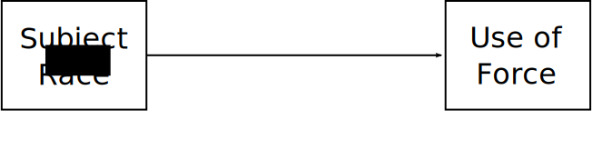
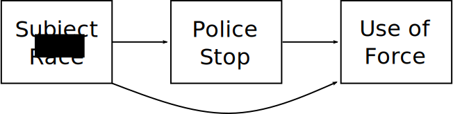
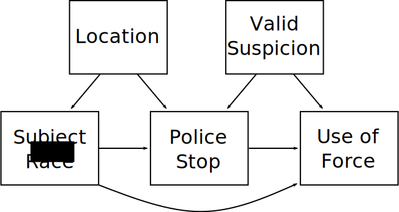

# Today
---

# Causality with Correlation

No correlation between speed of a car and how far gas pedal is pushed when going up and down hills
---

# Establishing Causation

Let's say we want to know if clearing a vacant lot reduces crime

--

&zwj;Problem: We only observe *one outcome* per unit—if we clear a lot, we don't see what happens when we don't clear it.1

.footnote[[1] This is often called the "fundamental problem of causal inference"]

--

We call the unobserved outcome a **counterfactual**—it is counter to the fact of what actually happened

-

Causal effects are differences between reality and unobserved counterfactuals

--

The goal of causal research is figuring out how to accurate estimate these "missing" values we cannot observe--the counterfactuals

---
# Causality (in Brief)

---
# Data Generating PRocesses

---
# Causal Effects

---
# Counterfactuals

---

# Correlations Require Variation

---

# Selection on Dependent Variable

---

# Nonlinearity
---
class: inverse
# Measuring Bias in Policing

### An example from Knox, Lowe, & Mummolo. 2020. "Administrative Records Mask Racially Biased Policing"

---
# Use of Force

&zwj;Question: Do police use more force against black civilians?

???

Note the effect here is really perceptions of race by police, not race itself.

--

Imagine you have sample of police encounters identical except for race.

*But* suppose bias leads police to:
1. Stop white civilians only for serious crimes
2. Stop black civilians with or without crime

--

Then, discard data on anyone police observed but *did not stop*.
+ You are now comparing use of force against white people committing serious crime to black ones committing no crime
+ If use of force were the same, *we'd have a serious problem*

--

*This is what police data actually show!*
* We only see the stopped people.
* There is no comparison group.

---
# What We Want

.image-threequarters[

]

&zwj;Question: How does race impact use of force?

---
# The Problem

.image-threequarters[

]

Problems

* Race impacts likelihood of stop
* Race also impacts use of force
* Can't control for stops *because we never see unstopped people*

---
# It Gets Worse

.image-threequarters[

]

More problems

* Racial composition varies by neighborhood
* Police deployments and strategy vary by neighborhood
* Suspicion predicts both stops and use of force--and can't be observed

???

Some novel papers have gotten at these before, but it is incredibly challenging.

One example is comparing drivers stopped when sun is up to when sun is down--when police can't see race.

---
# Consequences

* Detecting bias in the decision to stop is difficult

   + Hit rate tests

???

Hit rate tests estimate differences between likelihood of, for example, a frisk resulting in a found gun by race of suspect

If guns found less often on black suspects, indicates bias

Not perfect because need to adjust for fact that black folks live in different places and police strategies differ

One important thing is using more objective outcome: arrests might be biased, finding a weapon can't be biased unless they planting.

--

* If any stop bias exists, it is difficult to measure bias in...

   + Arrests
   + Use of force
   + Frisks
   + Shootings

???

This is an issue many if not most researchers working in this area don't fully grasp

Vast majority of work in area does not account properly for this

--

* Raw numbers can easily show *opposite patterns* from underlying reality.

* Studies showing no bias--or anti-white bias--get *lots* of media, social media, and political traction.

???

Fryer paper making the rounds back last summer showed this, but was just wrong.

---

# Causality and QUalitative Data

Sometimes quantitative data is not up to the task of identifying an effect of interest

McElreath gender, citations, NAS, quality DAG
