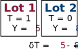
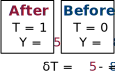
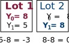
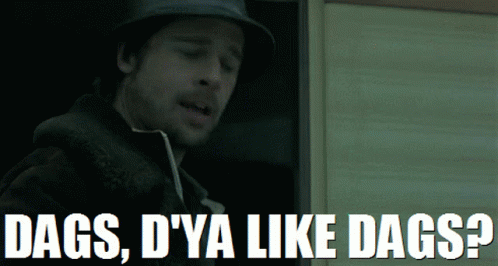
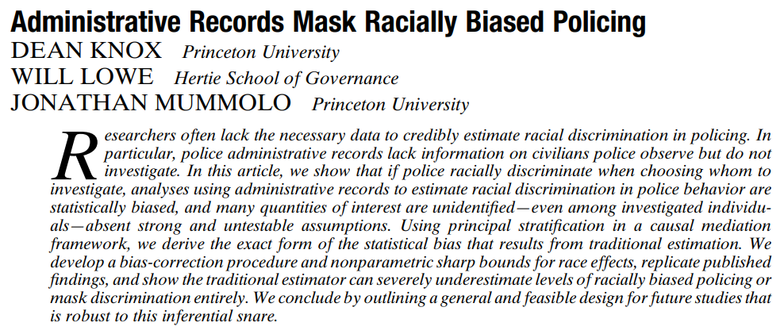
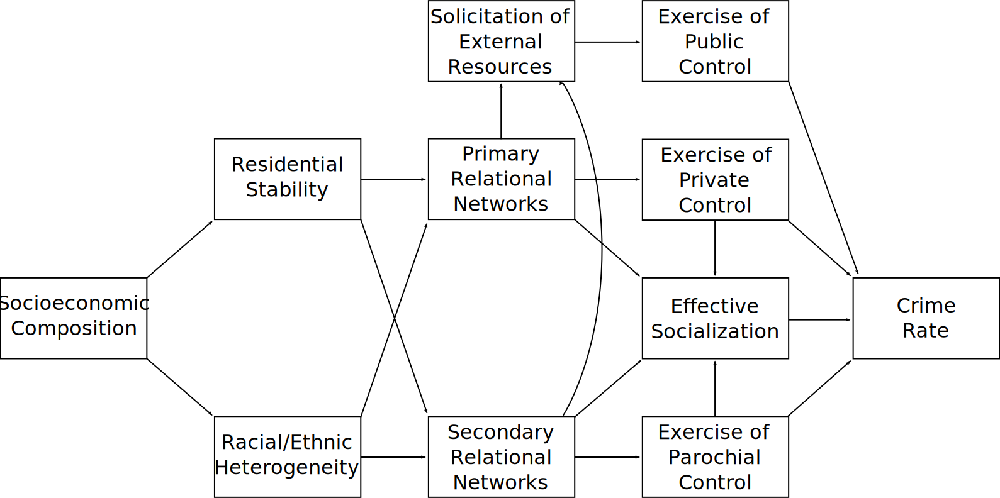
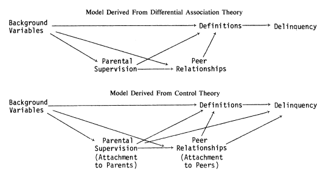
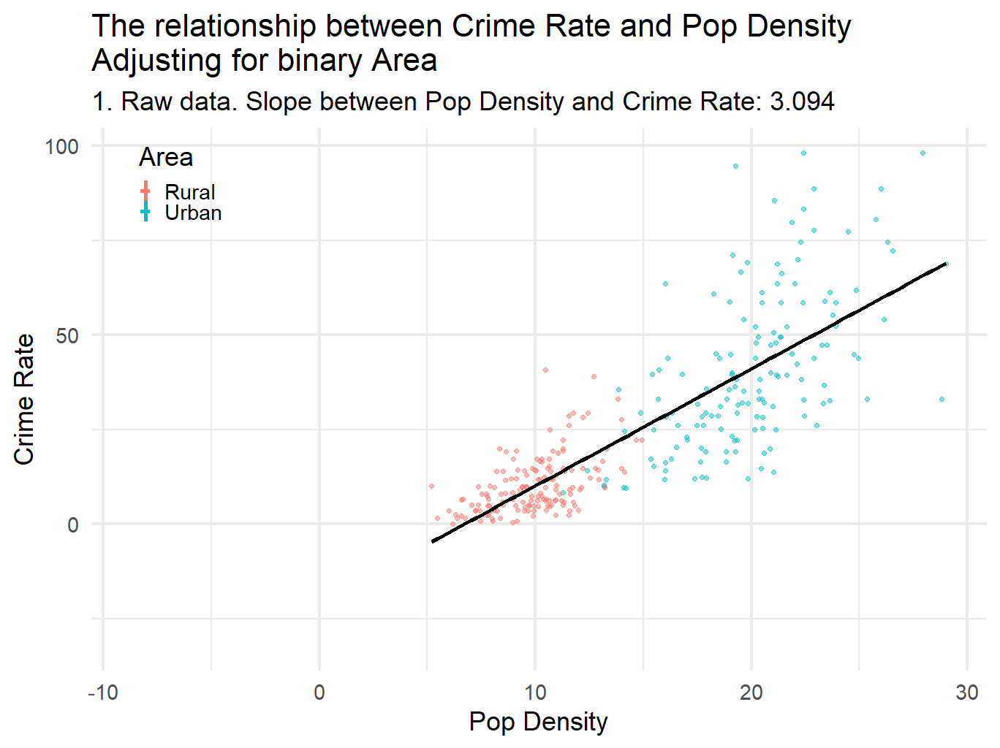

```{r setup, include = FALSE}
knitr::opts_chunk$set(echo=FALSE, warning = FALSE, message = FALSE, dev = "svg", fig.height = 5, dev.args=list(bg="transparent"))
```


# Today

* What is causality anyway?

* Causal graphs

   * Types of paths
   * An example

* Theory testing

   * Turning theories into graphs
   * Turning graphs into estimators


---

# Causality (in Brief)


$X$ causes $Y$ if changing *only* $X$ would change $Y$

--

&zwj;This is quite broad:

* $X$ is typically not the only cause

   * e.g., $X$ and $Z$ can both be causes of $Y$

--

* $X$ may cause $Y$ for multiple reasons

   * e.g., $X$ may cause $Z$ which causes $Y$ ( $Z$ is a *mechanism*)

--

* $X$ may only cause $Y$ in certain contexts

   * e.e., $X$ may cause $Y$ only when $Z$ is present

--

.text-center[
*All that matters for the relationship to be causal is that changing the distribution of $X$ would result in a different distribution of $Y$*
]

--

We call the process of estimating a causal effect **identification**

---

# Theory and Causes


All scientific theories are causal: *They explain **why** things happen*

--

In criminology:

* "Increasing the perceived risk of being caught reduces the likelihood of a person committing a particular crime"
* "Increasing a person's self-control reduces their involvement in all crime"
* "Learning violent definitions of situations increases a person's likelihood of using violence"
* "Strong social institutions in neighbourhoods reduce crime."
* "Reducing interactions between potential offenders and targets reduces crime in places."

--

These are all testable, causal propositions about how the world works

--

Theory testing is **causal inference**: Drawing *causal conclusions* from data

* Doing this convincingly requires identifying causal effects


---

# The Problem

Let's say we want to know if we can reduce crime by clearing vacant lots

* We want to identify the effect of lot clearing on crime

--

But we only see *one outcome* per lot:<sup>1</sup>

* If we clear a lot, we don't see what happens if we had not.
* If we *don't* clear it, we don't see what happens if we had.

.footnote[[1] This is often called the "fundamental problem of causal inference"]

--

We call whichever outcome we don't see a **counterfactual**—it is counter to the fact of what actually happened

--

Causal effects are *differences* between these **potential outcomes**:

1. What actually happened, which we see (factual)
2. An alternative, which we do not observe (counterfactual)

--

.text-center[
*How do we calculate a difference when we only see one outcome?*
]

---

# Between Comparison

.pull-left[

We could compare two lots:

* **One not cleared (T=0)**
* .strong-blue[One cleared (T=1)]


And use the difference in crime (bT) as a causal effect

]
.pull-right[

]

--

&nbsp;

*But what if the difference is because the lots are different?*

--

* We could compare only lots that look *identical*

--

*But, if those lots are identical, why did one get cleared and not the other?*

* We might have missed an important difference
* We wouldn't be sure unless we knew *why* each lots get cleared

---

# Within Comparison

.pull-left[

We could compare the same lot:

* **Before clearing (T=0)**
* .strong-blue[After (T=1)]

And use the before-and-after crime difference (bT) as a causal effect

]
.pull-right[

]

--

&nbsp;

*But what if the crime change was going to happen anyway?*

* The clearing simply coincided with the crime change
* Worse, maybe the change in crime *caused the clearing*

--

*Or, what if the lot was cleared **because** it would make a difference here?*

* What if there would be no difference for *other* lots?

---

# Potential Outcomes

.pull-left[
All of these problems are really one problem:

*Differences in **potential outcomes** between cleared and uncleared lots*
]

.pull-right[

]

--

These problems are resolved if the potential outcomes for cleared and uncleared lots are *the same on average* (unrelated to the treatment)

The average difference in outcomess then provides an unbiased estimate of the causal effect (the estimand)

--


.text-center[
*How do we make sure the cleared and uncleared lots are the same?*
]


---

# Randomization

*Randomized controlled trials do this*

* Take a relatively large number of lots
--

* Randomly assign treatment: clear some lots but not others
--

* On average, cleared and uncleared will be similar *in every way except for clearing*

--

Randomization makes treatment **independent** of potential outcomes

* Clearing is equally likely no matter how much a lot would benefit

--

If we randomly assign a treatment, we can estimate a causal effect as the average difference in outcomes between treated groups

* We call this the **average treatment effect**
* You can calculate this with a *cross-tab*

--

.text-center[
*What if we're interested in things we can't randomly assign?*
]

---

# Back to the DGP

When we can't **randomize**, we need to **theorize**

--

We need to figure out the **data generating process** for our treatment and outcome

* What makes some units get treated?
* What makes treatment more (or less) effective for some units?

--

This requires making **assumptions**, which are part of your **model**

* $Z$ is unrelated to $X$
* $B$ only causes $Y$ through $C$

--

.text-center[
*If our model is correct, it tells us exactly how to identify the causal effect we want*
]

--

.text-center[
*So how do we make the model?*
]

---
class: inverse

# Directed Acyclic Graphs

&nbsp;



---

# Causal Graphs

.pull-left[
Classic statistics is mathy, using things like this:

$$Y = f(X,Z)$$
... to say $Y$ is caused by a combination of $X$ and $Z$

]

--

.pull-right[

We're going to work with graphs instead:

```{tikz dag-1, fig.width = 3, cache = TRUE}
\usetikzlibrary{positioning}
\definecolor{black}{HTML}{000000}
\tikzset{
    > = stealth,
    every node/.append style = {
        draw = none,
        scale = 3
    },
    every path/.append style = {
        arrows = ->,
        draw = black,
        fill = none,
        scale = 1,
        line width = 1.5mm
    },
    hidden/.style = {
        draw = black,
        shape = circle,
        inner sep = 1pt
    }
}
\tikz{
    \node (Y) at (0,0) {$Y$};
    \node (X) at (5, 2) {$X$};
    \node (Z) at (5, -2) {$Z$};
    \path (X) edge (Y);
    \path (Z) edge (Y);
  }
```

]

--

Directed acyclic graphs have pretty simple rules:

* Arrows between variables point from causes to outcomes (directed)

--

* No arrow means no (direct) causal relationship

--

* Something can't cause itself... *even through other things* (acyclic)

--

.text-center[
*Causal graphs are a way to write out a model that tells you how to identify effects*
]

---

# Paths

.pull-left[

A "path" is any set of arrows linking two variables together

There are three paths from X to Y:

* $X \rightarrow Y$
* $X \leftarrow Z \rightarrow Y$
* $X \rightarrow W \leftarrow Y$

]

.pull-right[
```{tikz dag-2, fig.width = 3, cache = TRUE}
\usetikzlibrary{positioning}
\definecolor{black}{HTML}{000000}
\tikzset{
    > = stealth,
    every node/.append style = {
        draw = none,
        scale = 3
    },
    every path/.append style = {
        arrows = ->,
        draw = black,
        fill = none,
        scale = 1,
        line width = 1.5mm
    },
    hidden/.style = {
        draw = black,
        shape = circle,
        inner sep = 1pt
    }
}
\tikz{
    \node (Y) at (0,0) {$Y$};
    \node (X) at (5,5) {$X$};
    \node (Z) at (0,5) {$Z$};
    \node (W) at (5,0) {$W$};
    \path (X) edge (Y);
    \path (Z) edge (Y);
    \path (Z) edge (X);
    \path (Y) edge (W);
    \path (X) edge (W);
  }
```
]

--

Let's say we want to know the effect of $X$ on $Y$

* Paths where all arrows point from $X$ to $Y$ are called **front doors**
* Paths where arrows point to both $X$ to $Y$ are **back doors**
* Paths where arrows point *at* each other are **colliders**

--

We estimate effects *through front doors* by closing *all back doors*


---

# Closing Back Doors

Variables that open back doors are called **confounders**

* Confounders cause *dependence between treatment and potential outcomes*

--

We close doors by **adjusting** or **controlling** or **holding constant** variables along the path in statistical models<sup>1</sup>

.footnote[[1] We'll see this in a bit]

--

.pull-left[

Adjusting for Z closes the back door

The only remaining path is the front door we're interested in

The effect of $X$ on $Y$ is identified


]

.pull-right[

```{tikz dag-3, fig.width = 3, cache = TRUE}
\usetikzlibrary{positioning}
\definecolor{black}{HTML}{000000}
\tikzset{
    > = stealth,
    every node/.append style = {
        draw = none,
        scale = 3
    },
    every path/.append style = {
        arrows = ->,
        fill = none,
        scale = 1,
        line width = 1.5mm
    },
    hidden/.style = {
        draw = black,
        shape = circle,
        inner sep = 1pt
    }
}
\tikz{
    \node (Y) at (0,0) {$Y$};
    \node (X) at (5,5) {$X$};
    \node[color = gray] (Z) at (0,5) {$Z$};
    \path (X) edge (Y);
    \path[color = gray] (Z) edge (Y);
    \path[color = gray] (Z) edge (X);
  }
```
]

---

# More Front Doors

Very often your model has multiple front doors

--

You don't adjust for these—they're ways $X$ impacts $Y$!

* We call these **mechanisms** or **mediators**

--

.pull-left[

We've still adjusted for $Z$

But there are *two* front doors

* $X \rightarrow Y$
* $X \rightarrow A \rightarrow Y$

The effect of $X$ on $Y$ is identified!
]

.pull-right[

```{tikz dag-4, fig.width = 3, cache = TRUE}
\usetikzlibrary{positioning}
\definecolor{black}{HTML}{000000}
\tikzset{
    > = stealth,
    every node/.append style = {
        draw = none,
        scale = 3
    },
    every path/.append style = {
        arrows = ->,
        fill = none,
        scale = 1,
        line width = 1.5mm
    },
    hidden/.style = {
        draw = black,
        shape = circle,
        inner sep = 1pt
    }
}
\tikz{
    \node (Y) at (0,0) {$Y$};
    \node (X) at (5,5) {$X$};
    \node (A) at (5,0) {$A$};
    \node[color = gray] (Z) at (0,5) {$Z$};
    \path (X) edge (Y);
    \path[color = gray] (Z) edge (Y);
    \path[color = gray] (Z) edge (X);
    \path (X) edge (A);
    \path (A) edge (Y);
  }
```
]

--

&nbsp;

The *total* estimated effect of $X$ on $Y$ will be the sum of all paths leading between them.

---

# Colliders

Colliders are the *opposite* of back door paths: They *block* associations from going down their path

--

If you control for a collider on the path between $X$ and $Y$, it opens the association back up and *introduces bias*

--

.pull-left[

Adjusting for Z closes the back door

But here we've adjusted for $W$ too

This introduces bias!


]

.pull-right[

```{tikz dag-5, fig.width = 3, cache = TRUE}
\usetikzlibrary{positioning}
\definecolor{black}{HTML}{000000}
\tikzset{
    > = stealth,
    every node/.append style = {
        draw = none,
        scale = 3
    },
    every path/.append style = {
        arrows = ->,
        fill = none,
        scale = 1,
        line width = 1.5mm
    },
    hidden/.style = {
        draw = black,
        shape = circle,
        inner sep = 1pt
    }
}
\tikz{
    \node (Y) at (0,0) {$Y$};
    \node (X) at (5,5) {$X$};
    \node[color = red] (W) at (5,0) {$W$};
    \node[color = gray] (Z) at (0,5) {$Z$};
    \path (X) edge (Y);
    \path[color = gray] (Z) edge (Y);
    \path[color = gray] (Z) edge (X);
    \path[color = red] (Y) edge (W);
    \path[color = red] (X) edge (W);
  }
```
]

--

Controlling for a collider is sometimes called **selection bias** or **conditioning on a post-treatment variable**.


---

# Unobservabed Variables

A DAG *must* accurately represent what we think the data generating process is to be useful

--

Sometimes we know a variable is important but we can't measure it


--

.pull-left[

Unobserved variables are often indicated with circles

Because they're unobserved, we can't adjust for them *directly*

Here we can still block the path through $W$ by adjusting for $Z$
]

.pull-right[

```{tikz dag-6, fig.width = 3, cache = TRUE}
\usetikzlibrary{positioning}
\definecolor{black}{HTML}{000000}
\tikzset{
    > = stealth,
    every node/.append style = {
        draw = none,
        scale = 3
    },
    every path/.append style = {
        arrows = ->,
        fill = none,
        scale = 1,
        line width = 1.5mm
    },
    hidden/.style = {
        draw = black,
        shape = circle,
        inner sep = 1pt,
        line width = .5mm
    }
}
\tikz{
    \node (Y) at (0,5) {$Y$};
    \node (X) at (5,5) {$X$};
    \node[hidden] (W) at (5,0) {$W$};
    \node (Z) at (0,0) {$Z$};
    \path (X) edge (Y);
    \path (W) edge (X);
    \path (W) edge (Z);
    \path (Z) edge (Y);
  }
```
]

--

Most of the time we can't observe *everything* that matters, but rigorous research will acknowledge this

--

.text-center[
*This is all very abstract, so let's put them to work*
]

---
class:

# DAGs at Work

&nbsp;

&nbsp;


---
class: inverse
# Measuring Bias in Policing

&nbsp;



---
# Use of Force


&zwj;Question: *Do US police use more force against black civilians?*

--

Imagine you sample police encounters **identical** except for race

*But* suppose bias leads police to:

 * Stop white civilians only for crimes
 * Stop black civilians with or without crime

--

Then, discard data on anyone police observed but *did not stop*.

You are now comparing use of force between two groups:
   
* White people committing crime
* Black people committing no crime *or* committing a crime

--

If use of force were the **same**, *we'd have a serious problem*

--

*This is what police data actually show: we only see the stopped people!*


---

# What We Want

&nbsp;

```{tikz klm-1, fig.width = 3, cache = TRUE}
\usetikzlibrary{positioning}
\definecolor{black}{HTML}{000000}
\tikzset{
    > = stealth,
    every node/.append style = {
        draw = none,
        scale = 3
    },
    every path/.append style = {
        arrows = ->,
        fill = none,
        scale = 1,
        line width = 1.5mm
    },
    hidden/.style = {
        draw = black,
        shape = circle,
        inner sep = 1pt
    }
}
\tikz{
    \node (R) at (0,0) {Race};
    \node (F) at (6,0) {Force};
    \path (R) edge (F);
  }
```

&nbsp;

&zwj;Question: How does race impact use of force?

--

We could compare how often force is used on white vs. black subjects

---
# The Problem

&nbsp;

```{tikz klm-2, fig.width = 3, cache = TRUE}
\usetikzlibrary{positioning}
\definecolor{black}{HTML}{000000}
\tikzset{
    > = stealth,
    every node/.append style = {
        draw = none,
        scale = 3
    },
    every path/.append style = {
        arrows = ->,
        fill = none,
        scale = 1,
        line width = 1.5mm
    },
    hidden/.style = {
        draw = black,
        shape = circle,
        inner sep = 1pt
    }
}
\tikz{
    \node (R) at (0,0) {Race};
    \node[draw = black] (S) at (6,0) {Stop};
    \node (F) at (12,0) {Force};
    \path[color = gray] (R) edge (S);
    \path (S) edge (F);
    \path (R) edge [bend right=30] (F);
  }
```

&nbsp;

&zwj;Problem: Race impacts likelihood of stop, but *we never see unstopped people*

* We've conditioned on *being stopped*—a mediator!
* We've blocked part of our front door!

--

If police stop black subjects for more minor things, then an equal proportions of use of force *actually indicates bias*

---
# It Gets Worse

&nbsp;

```{tikz klm-3, fig.width = 3, cache = TRUE}
\usetikzlibrary{positioning}
\definecolor{black}{HTML}{000000}
\tikzset{
    > = stealth,
    every node/.append style = {
        draw = none,
        scale = 3
    },
    every path/.append style = {
        arrows = ->,
        fill = none,
        scale = 1,
        line width = 1.5mm
    },
    hidden/.style = {
        draw = black,
        shape = circle,
        inner sep = 1pt
    }
}
\tikz{
    \node (R) at (0,0) {Race};
    \node (S) at (6,0) {Stop};
    \node (F) at (12,0) {Force};
    \node (L) at (3,3) {Location};
    \node (V) at (9,3) {Suspicion};
    \path (R) edge (S);
    \path (S) edge (F);
    \path (R) edge [bend right=30] (F);
    \path (L) edge (R);
    \path (L) edge (S);
    \path (V) edge (S);
    \path (V) edge (F);
  }
```

&nbsp;

More problems

* Racial composition varies by neighborhood
* Police deployments and strategy vary by neighborhood
* Reasonable suspicion predicts both stops and use of force--and can't be observed


---
# Consequences

* Detecting bias in the decision to stop is difficult

--

* If any stop bias exists, it is difficult to measure bias in...

   * Arrests
   * Use of force
   * Frisks
   * Shootings

--

* Raw numbers can easily show *opposite patterns* from underlying reality.

* Studies showing no bias—or anti-white bias—get *lots* of media, social media, and political traction.

---
# Theory Testing

&nbsp;



.footnote[Source: Adapted from Bursik & Grasmick 1993]

---

# Recursive Models

Criminological theories tell us how to construct DAGs

--

Often this is fairly explicit, such as when authors provide a causal diagram... *and it already obeys DAG rules*

--

&nbsp;



.footnote[Source: [Matsueda (1982)](https://doi.org/10.2307/2095194)]


---

# Nonrecursive Models

This is less clear when the causal diagram provided doesn't conform to DAG rules

--


--

Converting a model with **cycles** into an **acyclic** one can take some thought

--

*All causal relationships really are acyclic though*

---

# Broken Windows DAG

Usually the trick to converting a cyclic graph to an acyclic one is realizing effects *occur over **time***

&nbsp;

```{tikz bwt, fig.width = 3, cache = TRUE}
\usetikzlibrary{positioning}
\definecolor{black}{HTML}{000000}
\tikzset{
    > = stealth,
    every node/.append style = {
        draw = none,
        scale = 3
    },
    every path/.append style = {
        arrows = ->,
        fill = none,
        scale = 1,
        line width = 1.5mm
    },
    hidden/.style = {
        draw = black,
        shape = circle,
        inner sep = 1pt
    }
}
\tikz{
    \node (D1) at (0,6) {$\text{Disorder}_1$};
    \node (C1) at (0,0) {$\text{Crime}_1$};
    \node (S1) at (0,3) {$\text{Control}_1$};
    \node (D2) at (12,6) {$\text{Disorder}_2$};
    \node (C2) at (12,0) {$\text{Crime}_2$};
    \node (S2) at (12,3) {$\text{Control}_2$};
    \path (D1) edge (D2);
    \path (D1) edge (C2);
    \path (D1) edge (S2);
    \path (C1) edge (C2);
    \path (C1) edge (S2);
    \path (S1) edge (D1);
    \path (S1) edge (C1);
    \path (S2) edge (D2);
    \path (S2) edge (C2);
    \path (S1) edge (S2);
  }
```

--

Another way is through **intervening** or **cross-level** mechanisms

* Many macro theories are circular without individual-level mechanisms

---

# No Graphical Model

Making a DAG is least clear when the authors provide no graphical representation of the model at all<sup>1</sup>

.footnote[[1] Or when you're developing something new yourself!]

--

The process:

* Record all the core variables they use

   * e.g., self control

--

* Make note of causal statements

   * e.g., "self control **influences** crime by..."
   * Make these into arrows!

--

* Try to reconcile circular paths

   * Consider temporal order
   * Consider cross-level mechanisms

---
class: inverse

# From DAG to Estimator

---

# Estimating Causal Effects

Once you have a DAG, it is remarkably easy to proceed to an estimator

--

1. Figure out what you can and cannot measure

--

2. If your measures let you close all back doors...

   * Adjust for back door variables
   * Don't adjust for colliders or mechanisms
   * Estimate the causal effect

--

3. If you can't close all back doors, either...

   * Close what you can and estimate association
      * Might be *close* to identified!
   * *Give up*
   * **Get clever**

---
class: inverse

# Controlling for Variables


---

# Regression Again

So far we've just fit a simple straight line using one variable predicting another

.pull-left[
```{r}
lm(crime_rate ~ pop_density, data = communities) %>% 
  broom::tidy() %>%
  select(Term = term, Estimate = estimate) %>%
  mutate(Term = case_when(
    Term == "AreaUrban" ~ "Urban",
    TRUE ~ str_to_title(str_replace(Term, "_", " "))
  ),
  Estimate = round(Estimate, 2)) %>%
  arrange(desc(Term)) %>%
  pander::pander()
```


]
.pull-right[

```{r}
library(tidyverse)
communities <- 
  read_csv("https://clanfear.github.io/ioc_iqa/_data/communities.csv")
ggplot(communities, aes(x = pop_density, y = crime_rate)) + 
  geom_point() + 
  geom_smooth(method = "lm") +
  labs(x = "Pop Density", y = "Crime Rate") +
  theme_minimal()
```

]


---

# Multiple Predictors

When we add predictors, we are **adjusting** or **controlling** for them to identify the effect we're interested in

```{r}
library(tidyverse)

lm(crime_rate ~ area + pop_density, data = communities) %>% 
  broom::tidy() %>%
  select(Term = term, Estimate = estimate) %>%
  mutate(Term = case_when(
    Term == "areaUrban" ~ "Urban",
    TRUE ~ str_to_title(str_replace(Term, "_", " "))
  ),
  Estimate = round(Estimate, 2)) %>%
  arrange(desc(Term)) %>%
  pander::pander()
```

New interpretation:

* "The association between density and crime, adjusting for the type of area*"
* "The average crime rate difference for urban areas, compared to rural ones, adjusting for population density"

---

# How it Works

```{r, eval= FALSE}
library(gganimate)

df <- communities |>
  group_by(area) %>%
  mutate(mean_pop_density=mean(pop_density),
         mean_crime_rate=mean(crime_rate)) %>%
  ungroup() |>
  mutate(dm_pop_density = pop_density -mean_pop_density,
         dm_crime_rate = crime_rate - mean_crime_rate)

#Calculate correlations
before_cor <- paste("1. Raw data. Slope between Pop Density and Crime Rate: ", round(coef(lm(df$crime_rate~df$pop_density))["df$pop_density"],3),sep='')
after_cor <- paste("6. Slope between Pop Density and Crime Rate controlling for Area: ",round(coef(lm(df$dm_crime_rate~df$dm_pop_density))["df$dm_pop_density"],3),sep='')


#Add step 2 in which pop_density is demeaned, and 3 in which both pop_density and crime_rate are, and 4 which just changes label
dffull <- rbind(
  #Step 1: Raw data only
  df %>% mutate(mean_pop_density=NA,mean_crime_rate=NA,time=before_cor),
  #Step 2: Add x-lines
  df %>% mutate(mean_crime_rate=NA,time='2. Figure out what differences in Pop Density are explained by Area'),
  #Step 3: pop_density de-meaned 
  df %>% mutate(pop_density = pop_density - mean_pop_density,mean_pop_density=0,mean_crime_rate=NA,time="3. Remove differences in Pop Density explained by Area"),
  #Step 4: Remove pop_density lines, add crime_rate
  df %>% mutate(pop_density = pop_density - mean_pop_density,mean_pop_density=NA,time="4. Figure out what differences in Crime Rate are explained by Area"),
  #Step 5: crime_rate de-meaned
  df %>% mutate(pop_density = pop_density - mean_pop_density,crime_rate = crime_rate - mean_crime_rate,mean_pop_density=NA,mean_crime_rate=0,time="5. Remove differences in Crime Rate explained by Area"),
  #Step 6: Raw demeaned data only
  df %>% mutate(pop_density = pop_density - mean_pop_density,crime_rate = crime_rate - mean_crime_rate,mean_pop_density=NA,mean_crime_rate=NA,time=after_cor))

p <- ggplot(dffull, aes(y=crime_rate,x=pop_density,color=as.factor(area)))+
  geom_point(size = 3, alpha = 0.5)+
  geom_vline(aes(xintercept=mean_pop_density,color=as.factor(area)), size = 2)+
  geom_hline(aes(yintercept=mean_crime_rate,color=as.factor(area)), size = 2)+
  guides(color=guide_legend(title="Area"))+
  labs(title = "The relationship between Crime Rate and Pop Density\nAdjusting for binary Area", 
       subtitle ="\n{next_state}",
       x = "Pop Density",
       y = "Crime Rate")+
  geom_smooth(data = dffull |> filter(str_detect(time, "^(1|6)")), method = "lm", formula = "y ~ x", se = FALSE, color = "black", size = 2) +
  transition_states(time,
                    transition_length=c(12,32,12,32,12,12),
                    state_length=c(160,100,75,100,75,160),
                    wrap=FALSE)+
  ease_aes('sine-in-out')+
  exit_fade()+
  enter_fade() +
  theme_minimal(base_size = 30) +
  theme(legend.position = c(0.1, 0.9))

control_anim <- animate(p, nframes=200, height = 1024, width = 1368)
anim_save("img/control_anim.gif", control_anim)
```



---

# Causality without Correlation

No correlation between speed of a car and how far gas pedal is pushed when going up and down hills


---

# More Variables

&nbsp;

---

# Causality and QUalitative Data

Sometimes quantitative data is not up to the task of identifying an effect of interest


McElreath gender, citations, NAS, quality DAG
