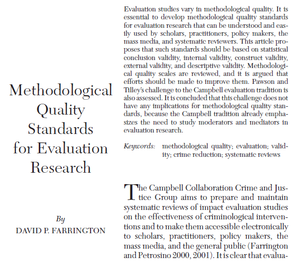
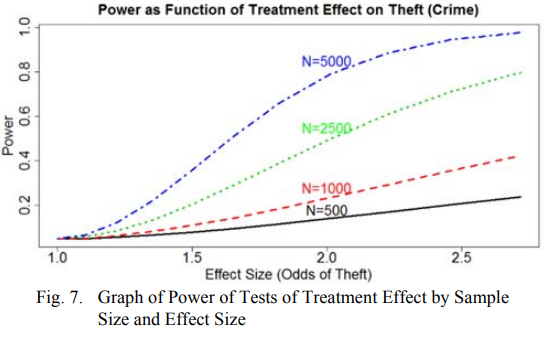
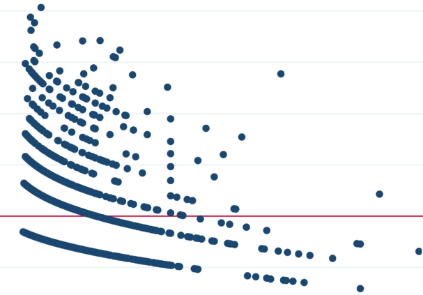
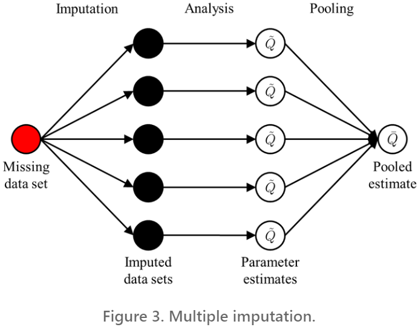
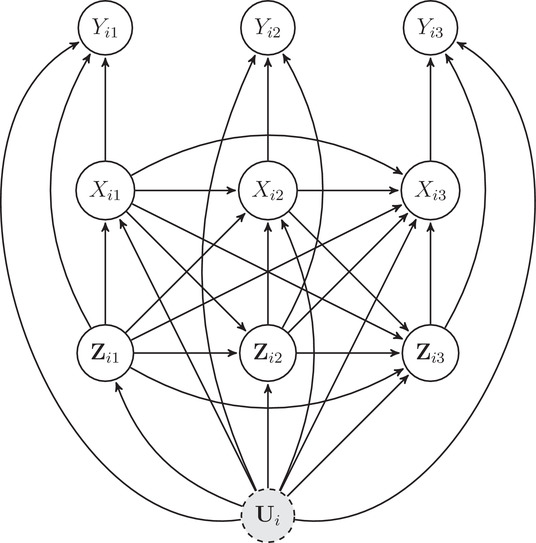
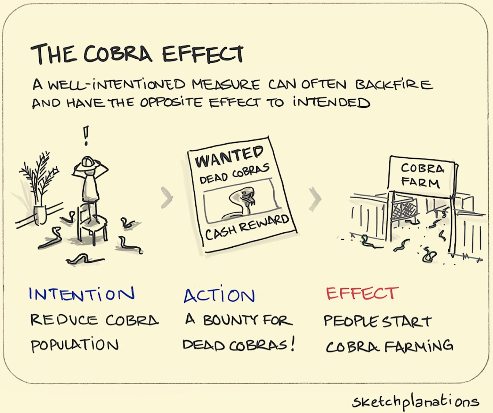
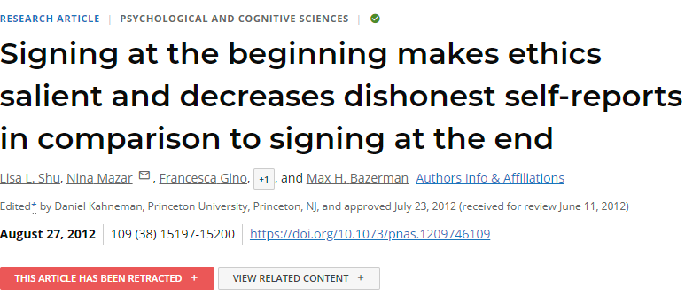
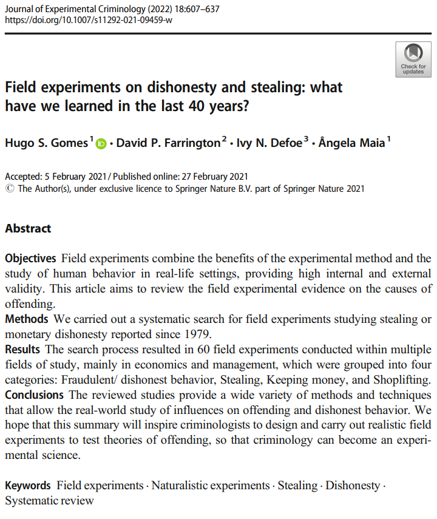

```{r setup, include = FALSE}
knitr::opts_chunk$set(echo=FALSE, warning = FALSE, message = FALSE, dev = "svg", fig.height = 5, dev.args=list(bg="transparent"))
library(tidyverse)
```


# Dual Purposes

Being a critical consumer of research

* This is the focus for today

--

Being a critical producer of research

* Turning critical consumption on yourself

--

&zwnj;Goal: Recognizing **rigour**

* Adherence to best practices
* Self-critical research

--

.text-center[
*Rigorous research is doing the best with what is available and being honest about the process, limitations, and inferences that can be made*
]


---
class: inverse

# Validity

&nbsp;




---

# Types of Validity

Internal validity

* **Identification**
* Congruence between theory and method

--

Construct Validity

* **Measurement**
* Congruence between conceptualization and operationalization

--

External validity

* **Generalizability**
* Sample-to-population or inter-population inference

--

Farrington separates out:

* Statistical conclusion validity
* Descriptive validity


---

# Internal Validity

**Internal validity** is the degree to which the quantity of interest is **identified**

--

* Causal: Are we confident the observed effect is due to the treatment?

* Non-causal: Are we confident the observed quantity is close to the quantity in the population?

   * e.g., a prevalence, mean, or association

--

Things to look out for:

* Well-explained **data generating process** (week 4)
* Sufficient **statistical power**
* Plausible **effect sizes**

---

# Data Generating Process

The key to establishing internal validity is *accurately modeling the relevant parts of the **data generating process***

--

When reading research:

* Draw the DAG for papers you read closely
* Evaluate it carefully
* If it is important, run it by a colleague or mentor

--

When conducting research:

* **Always draw the DAG**
* Always have colleagues or mentors look at it
* Use it to guide your analysis
* Include the DAG in your paper if it is illustrative

--

.text-center[
*Authors should make a convincing case for their model of the DGP*
]

---

# Statistical Power

The ability to *detect a meaningful effect* is a requirement for valid results


--


.pull-left[

&zwnj;Power:

* &uarr; with sample size

* &uarr; with strength of effect

* &darr; with confidence level

* &darr; with noise
]
.pull-right[

]

--

Differentiate between **precise nulls** and inconclusive evidence

* A precise near-zero estimate is evidence for *absence of an effect*
* A low precision insignificant estimate is not evidence for *no effect*

.text-center[
*Be wary of claims from underpowered studies<br>(e.g., with large confidence intervals)*
]

---

# Effect Sizes

Rigorous research will usually report and interpret **effect sizes**

* e.g., "Cleared lots displayed 30% less crime than uncleared lots"
* Larger effects are more **substantively significant**

--

Be suspicious of *very strong effects*, especially for minor treatments

* e.g., "rates of theft were 100% higher under the litter treatment"

--

Be suspicious of *too much explained variation*

* e.g., "eviction explains the entire effect of socioeconomic disadvantage on crime rates"

--

.text-center[
*The more variation one factor explains, the less others can explain*

*In complex data generating processes, it is unlikely that changing a single factor will cause large differences in the outcome*
]

---

# Estimation Complications

Thus far we've left out most of the technical details of **estimation**

--

.pull-left[
For example:

* Functional forms

   * i.e., curved lines

]
.pull-right[
```{r}
tibble(x = seq(0, 25, by = 0.1),
       y1 = 0.5*x + 1*x^2 - 0.05*x^3,
       y2 = 3*x + -0.3*x^2,
       y3 = -3*x) |>
  pivot_longer(y1:y3) |>
  ggplot(aes(x = x, y = value, color = name)) +
  geom_line(size = 2) +
  theme_void() +
  theme(legend.position = "none")
```
]

---
count:false

# Estimation Complications

Thus far we've left out most of the technical details of **estimation**

.pull-left[
For example:

* Functional forms

   * i.e., curved lines

* Discrete and categorical outcomes

]
.pull-right[


[Source: The Analysis Factor](https://www.theanalysisfactor.com/poisson-or-negative-binomial-using-count-model-diagnostics-to-select-a-model/)
]

---
count:false

# Estimation Complications

Thus far we've left out most of the technical details of **estimation**

.pull-left[
For example:

* Functional forms

   * i.e., curved lines

* Discrete and categorical outcomes

* Missing data

]
.pull-right[


[Source: Lo et al. (2019)](https://hdsr.mitpress.mit.edu/pub/4tx7h11w/release/2)
]

---
count:false

# Estimation Complications

Thus far we've left out most of the technical details of **estimation**

.pull-left[
For example:

* Functional forms

   * i.e., curved lines

* Discrete and categorical outcomes

* Missing data

* Temporal and spatial effects

]
.pull-right[


[Source: Imai & Kim (2019)](https://doi.org/10.1111/ajps.12417)
]


--

.text-center[
*These are all important*
]

--

.text-center[
*But only if the main identification strategy is correct!*
]


---

# Construct Validity

.text-center[
*Do your measured variables capture the concepts in the DGP that you're interested in?*
]

```{tikz dag-1, fig.width = 4, fig.height = 2, cache = TRUE}
\usetikzlibrary{positioning}
\definecolor{black}{HTML}{000000}
\tikzset{
    > = stealth,
    every node/.append style = {
        draw = none,
        color = black,
        scale = 3
    },
    every path/.append style = {
        arrows = ->,
        draw = black,
        scale = 1,
        line width = 1.5mm
    },
    hidden/.style = {
        draw = black,
        shape = circle,
        inner sep = 1pt
    }
}
\tikz{
    \node[hidden] (chi) at (0,0) {$\chi$};
    \node (X) at (5, 0) {$X$};
    \path (chi) edge (X);
  }
```

--

Common problems:

* Bad proxies / poor convergent validity

   * Measures that don't capture the unobservable of interest

--

* Poor discriminant validity

   * Measures that are indistinguishable from competing constructs

--

* Measurement error and low reliability

   * Measures that contain excess random (or non-random) variation

--

* **Inconsistent treatments**

---

# Consistency

**Consistency** is a necessary assumption of identifying causal effects

--

* There is only **one** type of treatment for any measured level

   * e.g., clearing a vacant lot as paving it vs. creating a park
   * **Compound treatment**: Multiple treatments inadvertently analyzed as if a single treatment

--

* An experimentally-assigned treatment is identical to the naturally-assigned one of interest

   * e.g., litter placed on a sidewalk is equivalent to "natural" litter

--

Consistency is a *major threat* to experimental research

* Implausible or unnatural lab and field experiment treatments
* Some treatments are inseparable from other conditions

--

.text-center[
*If a treatment sounds contrived, it is probably inconsistent*
]

---

# External Validity

*Would the results look similar in a new context?*

--

Threats to external validity:

* Non-representative samples

   * Treatment effect may only exist in this sample
   * Treatment effects may *differ* across populations

--

* Inconsistent treatments

   * Treatment effect may not exist when treatment is assigned naturally
   * Realistic treatments may only exist in less-controlled contexts

--

* Context-dependent results

   * Same units may behave differently in other contexts
   * Underlying data generating process can *change*

--

.text-center[
*External validity is difficult to establish, but mechanisms and sample info can be suggestive*
]

---

# General Signs of Rigor

Rigorous research typically displays most or all of these signs:

--

* Transparent

   * Everything that was done is reported in detail
   * Decisions are noted and justified
   * **Reproducibility** and **open data**
   * **Pre-registration**

--

* Careful

   * Acknowledges alternative explanations
   * Uses sensitivity or robustness tests

--

* Honest

   * Provides realistic implications—doesn't overhype
   * Describes assumptions and consequences if violated
   * Suggests ways to further test the findings


---
class: inverse

# Quantitative Skepticism

&nbsp;

&nbsp;


---

# Science is Cumulative

Most new novel findings are wrong

--

*So, when should you trust a finding?*

--

When it is **replicated**

* The more often something is found, the more you should be convinced

--

When it is **triangulated**

* The more something is found using different data sets and analysis approaches, the more you should be convinced

* *Corollary*: If something is only found using the same methods or with the same kind of data, you should be more skeptical

--

It is **compatible** with other trustworthy findings

* If the finding would overturn a well-established literature, you should be more skeptical

---

# Goodhart's Law

> When a measure becomes a target, it ceases to be a good measure ([Goodhart 1975](https://link.springer.com/chapter/10.1007/978-1-349-17295-5_4); [Strathern 1997](https://doi.org/10.1002/%28SICI%291234-981X%28199707%295:3<305::AID-EURO184>3.0.CO;2-4)).

--

.pull-left[

Goodhardt's law produces **perverse incentives**: Incentives that encourage *the opposite* of what was intended


* *The Cobra Effect*

* Crime rates and politics

* Use of force and depolicing

* *Academic publishing!*
]
.pull-right[

]

--

.text-center[
*This is a severe problem for measures of crime and police effectiveness*
]

---

# Peer Review

.pull-left[
A lot of great research is a struggle to get published

A lot of bad research gets published in high profile outlets
]
.pull-right[

]

--

&nbsp;

Being in a particular journal is a weak signal of quality for individual papers

* The publication process is *highly random*

--

Despite this, some journals are consistently very good<sup>1</sup>

* Good editors and editorial teams
* Ability to effectively solicit good reviewers

.footnote[[1] This is area specific—ask your mentors!]


---

# Secondhand Accounts

Authors commonly misstate the findings of cited papers

* Citing based on statements found in other articles
* Citing based on abstract, or worse, title
* Reading but misunderstanding

--

If authors make past research sound crazy, they're typically...

* Purposefully misrepresenting it
* Misunderstanding it

--

Don't contribute to this yourself:

* Don't cite things you didn't read
* Don't cite things you don't understand
   * Get help to understand important but challenging research

--

.text-center[
*Science is mostly reading other people's work*
]

---
class:inverse

# A Quick Reading Suggestion

&nbsp;


.footnote[
Source: [Road Trip with Raj @ unsplash](https://unsplash.com/photos/o4c2zoVhjSw)
]

---

# Review Papers

Reviews make literatures manageable for new scholars and practitioners

.pull-left-60[
* Summary reviews

   * Focus: Summarizing area
   * Audience: Newcomers
   * Great starting point

]

.pull-right-40[

]

---
count: false

# Review Papers

Reviews make literatures manageable for new scholars and practitioners

.pull-left-60[
* Summary reviews

   * Focus: Summarizing area
   * Audience: Newcomers
   * Great starting point

* Systematic reviews

   * Focus: Assessing evidence
   * Audience: Decisionmakers
   * Systematic search process
]

.pull-right-40[

]

---
count: false

# Review Papers

Reviews make literatures manageable for new scholars and practitioners

.pull-left-60[
* Summary reviews

   * Focus: Summarizing area
   * Audience: Newcomers
   * Great starting point

* Systematic reviews

   * Focus: Assessing evidence
   * Audience: Decisionmakers
   * Systematic search process

* Critical reviews

   * Focus: Gaps / challenges
   * Audience: Area researchers
   * New research directions
]

.pull-right-40[

]


---
class: inverse

# Wrap-Up

The quantitative half of the course is now over!

&nbsp;


