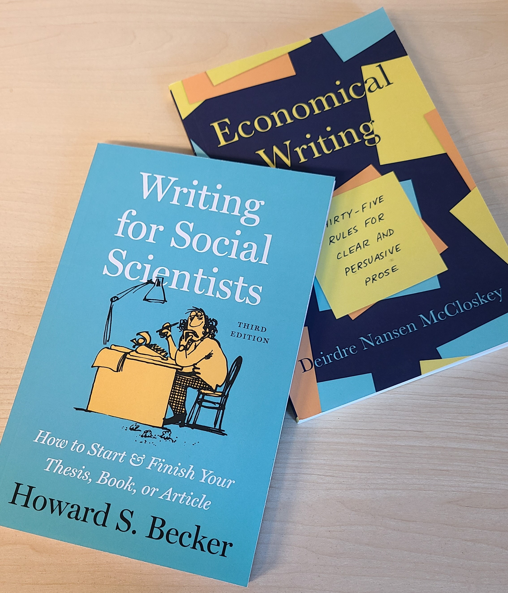
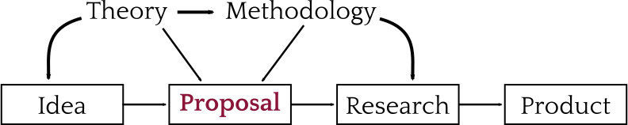

```{r setup, include = FALSE}
knitr::opts_chunk$set(echo=FALSE, warning = FALSE, message = FALSE, dev = "svg", fig.height = 5, dev.args=list(bg="transparent"))
library(tidyverse)
```


# Today

## Writing in General

## Writing Proposals


---

class: inverse

# Writing

<br>


---

# Target your writing

Professional (academic) writing is purposeful **communication** to an audience

--

.pull-left[
* Know the purpose

   + Argument
   + Description
   + Theoretical test
   + Policy evaluation
]

--

.pull-right[
* Know the audience

   + Examiners (e.g., essay or thesis)
   + Academics (e.g., journal)
   + Policy actors (e.g., policy brief)
   + Lay people (e.g., public scholarship)
]

--

.text-center[
*Everything you write should serve your purpose and be understood by your audience*
]


---

# When you write

.pull-left[
* **Clarity comes first**

   * *Do not write so you can be understood, but so that so you cannot be misunderstood*
]

.pull-right[

]

---
count:false

# When you write

.pull-left[
* **Clarity comes first**

   * *Do not write so you can be understood, but so that so you cannot be misunderstood*

* **Read** good books on writing &rarr;

* **Read** and emulate good writers

* **Read** your work out loud

   * *Good writing seems natural*
]

.pull-right[

]

---
count:false

# When you write

.pull-left[
* **Clarity comes first**

   * *Do not write so you can be understood, but so that so you cannot be misunderstood*

* **Read** good books on writing &rarr;

* **Read** and emulate good writers

* **Read** your work out loud

   * *Good writing seems natural*

* Have others read your work

   * *When someone says something is confusing they are always right*
]

.pull-right[

]

---

# Matsueda (2019)

.pull-left-70[
* Academic writing has a common structure
   + Efficient communication—*deviate at your peril*
   + **Hourglass** shape
      * Start with big picture
      * Narrow to what you did
      * Relate back to big picture
   
* **Mimic others**:
   * Prominent outlets
   * Good writers
   
* Highlight your contributions

* Literature reviews are **important**
   * Position your work in the conversation
]

.pull-right-30[
&nbsp;<br>
&nbsp;<br>
&nbsp;<br>

]

---

# Structure

Empirical articles or chapters rarely stray far from this:

1. **Abstract**
2. **Introduction**
3. **Literature Review**
4. Methods
5. Results
6. Discussion<sup>1</sup>

* Non-empirical works trade **methods** and **results** for more discussion
   * "Results" come from *others'* research (i.e., lit review)
* Proposals: 
   * Only a *tentative plan* for methods
   * Expectations / argument for value of results 

.footnote[
[1] A conclusion is really just a closing to the discussion!
]

--

.text-center[
*We'll talk about writing methods and results in detail next term*
]

---

## Abstract

* An elevator speech: Summarize the entire paper in 200 words

--

## Introduction

* **Hook the reader**
* State the research question
* Highlight contribution or main findings (optional)
* Foreshadow the structure of paper

--

## Literature Review

* **Motivate the research question and design**
   * This section is an **argument** not a summary
* Support key assumptions and arguments
   * *Your theoretical model and every variable should be covered*
* Lay out hypotheses (if you have them)
   * *This is often done in its own section before methods*

---
# Proposals

IMAGE

---

# Research Proposals

Proposals are:

* A step in the research process
* Informed by theory and methods




--

.pull-left[
&zwj;Reasons for proposals:

* Obtaining approval
* Securing funding
]
.pull-right[
&zwj;<br>
* Applying to PhD programs
* *Preregistration*
]

--

.text-center[
*Convincing someone it is **worth doing** and **you** can do it*
]
