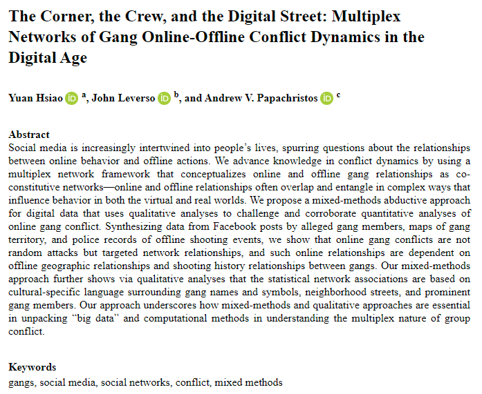
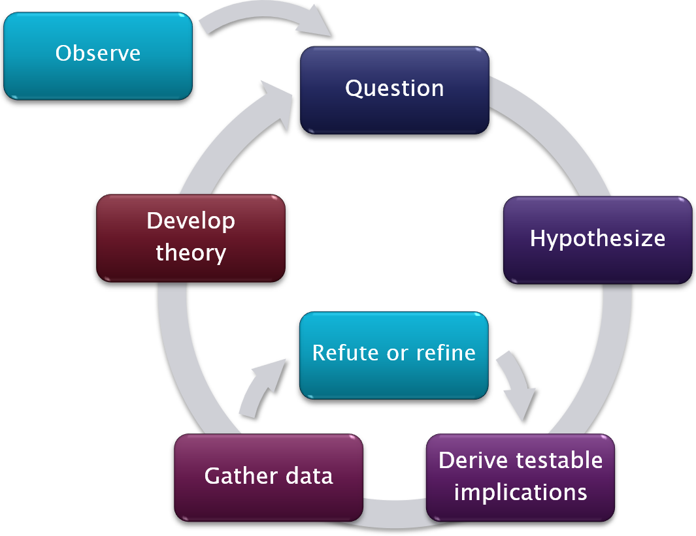
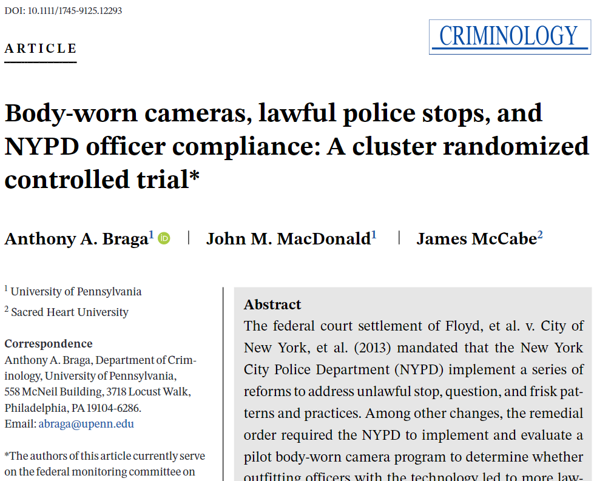
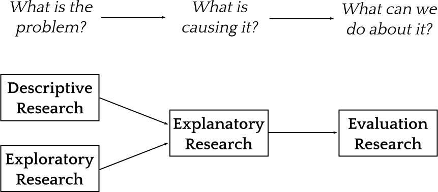
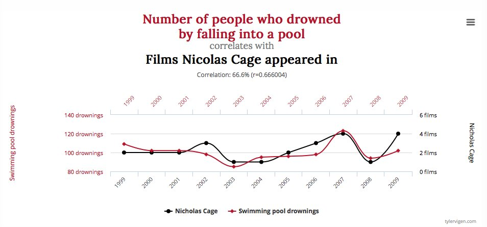
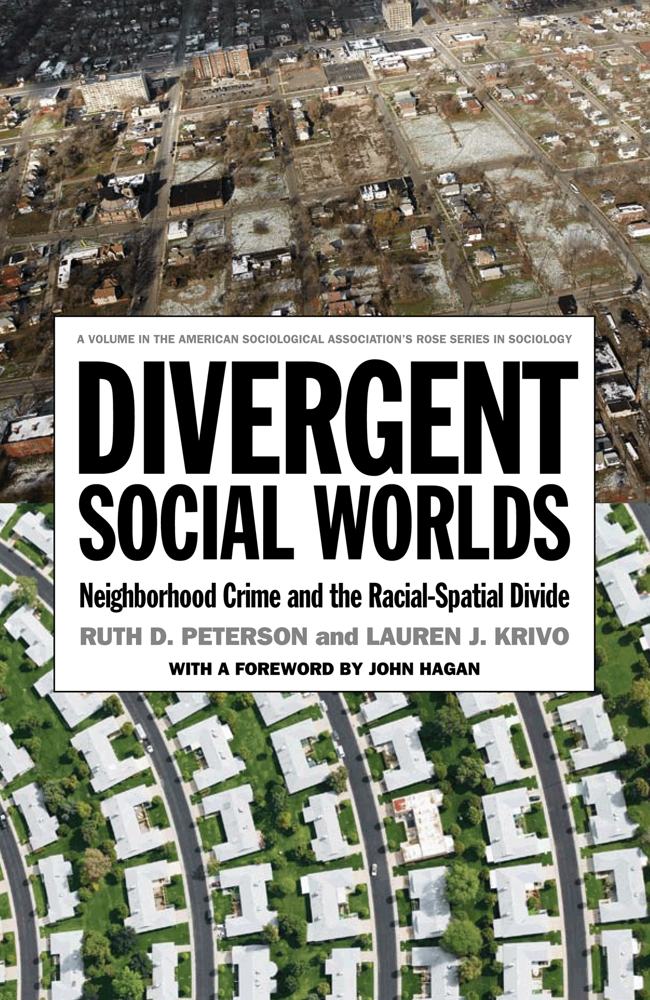
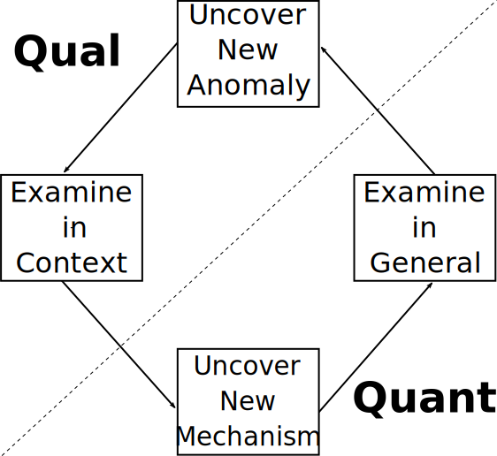
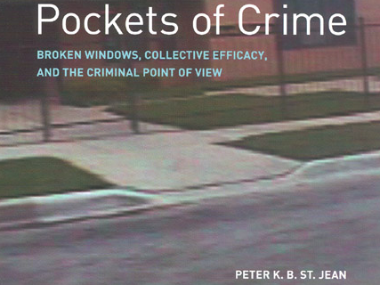
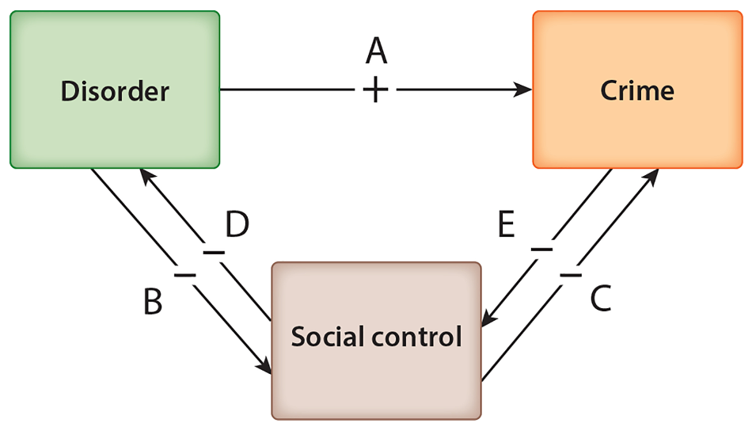
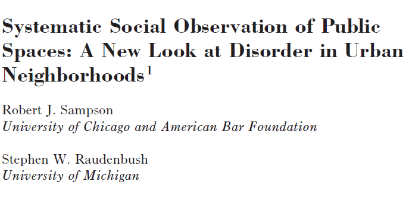

```{r setup, purl=FALSE}
#| include: false
knitr::opts_chunk$set(eval=TRUE, echo=TRUE, message=TRUE, warning=TRUE)
```


#  CRM Goals

* Understand what research is and how it is done

   * Survey major types of research in criminology
   
   * How to **ask good questions**

   * How to **answer questions effectively**

--

* Recognize unique challenges in criminological research

--

* Learn to critically evaluate research

--

* **Teach you to write an effective research proposal**

---

# What I cover

Mainly **methodology**:

* Theory and process of answering **research questions**

--

Secondarily **methods**:

* Procedures used to generate and interpret data

--

Split design:

* First half emphasizes quantitative approaches
* Second half emphasizes qualitative approaches

--

&#8203;Materials: [clanfear.github.io/ioc_crm/]()

* Lecture slides and readings (some on Moodle)
* Recordings posted on Moodle


---
class: inverse

# Criminological Research

&nbsp;


---


# Joining a conversation

Criminology is an ongoing conversation

--

To contribute to the conversation, you need to know:

* What the conversation is about
* What the current state is
* What its premises are

--

This requires understanding of **theory** and **methodology** and *how they relate to each other*

--

This understanding allows us to...

* Ask good **research questions**
* Develop good **research designs** to answer them
* Evaluate others' research

---

# Good Research Questions

What makes a research question *good*?

--

* It is empirically <strong>answerable</strong><sup>1</sup>

   * It is in some sense factual
   * It is identifiable *in principle*

.footnote[[1] What answerable *means* is subject to epistemological debate.]

--

* It improves our understanding of the world (i.e., it informs **theory**)

   * An answer would change how we think or behave
   * An answer would solve a significant problem

--

&nbsp;

.text-center[
*These are subjective: You must make an argument!*
]

---

# Sources of Questions

* **Theory**

   * We have expectations—are they correct?
      * *I think these expectations are wrong!*
   * Are there competing expectations from different theories?
      * *Adjudicate between them!*

--

* **Ignorance**

   * We have no expectations!
   * True scientific ignorance is **very rare**<sup>1</sup>
      * Usually: "is $x$ like $y$?" (back to theory!)
      * Almost never: "nothing is like $x$"
   * Must make convincing argument no extant theory applies

.footnote[[1] Criminology, like other social sciences, is plagued with reinvention of the wheel, due to rewarding the appearance of novelty.]

--


.text-center[
*In either case, you're probably going to need to read a **lot**.*
]

---

# Types of Questions

* **Description** - What does this look like?

   * *How do crime rates differ across neighbourhoods?*
   * *How does exposure to violence vary over the life course?*

--

* **Exploration** - What is going on here?

   * *Do violent neighbourhoods have different interpersonal networks?*
   * *Are children exposed to violence more likely to carry guns?*

--

* **Explanation** - Why is this happening?

   * *Do strong interpersonal networks reduce neighbourhood violence?*
   * *Does childhood victimization increase gun carrying?*

--

* **Evaluation** - Does this work?

   * *Does creating a neighbourhood organization reduce violence?*
   * *Does this child victims' program reduce gun carrying?*

--

.text-center[
*Each of these requires a different research design!*
]


---

# Research Design


**Research design** is *strategy* for answering research questions:

* What data are needed
* How to obtain those data
* How to analyze those data
* How to interpret results

--

**Good research design** is that which can answer your (good) research question

--

There are many different types of empirical research design

The type you choose is determined by your *question*

---

# Descriptive Research

* Accurate and systematic description of something

--

* Can take many forms, e.g.:

   * **Incidences** and **prevalences**

      * *How often do Americans witness gun violence?*
--

   * **Processes**

      * *How are police stop records generated?*
--

   * **Experiences**

      * *How do incarcerated women experience reintegration?*
--

<br>

.text-center[
*Description is the foundation of science: We must know **what** before we can explain **why***
]

---


.text-center[
*What does exposure to gun violence look like over the life course?*
]

---

# Exploratory Research

* Building insight into a phenomenon with limited data or expectations

   * No theory testing or causal claims
   * *Is there something interesting going on here?*
   * *When does this thing occur?*

--

* Often similar to descriptive research, but searching for:

   * **Meanings**
      * *How is offending related to decision-making processes?*
   * **Potential explanations**
      * *Are officers convicted of misconduct different than others?*
   * **Predictions**
      * *What are risk factors for witnessing gun violence?*

--

* Often used to develop explanatory questions

   * *Which of these risk factors are causes?*
   * *Do these meanings cause behaviour or are they a result of it?*


---



.text-center[
*How are online gang conflicts related to offline gang violence?*
]

---

# Exploratory &#8800; Atheoretical

**Reminder:** *There is no atheoretical research*

> Theory is never completely isolated from problems of empirical research, any more than empirical research is free from theoretical assumptions (Layder 1994:vi)

> Theory is inextricably involved in the process of data-gathering and data-interpretation (Bottoms 2007:75)


--

Research assumes:

* What is worth studying
* What questions to ask
* How to measure
* How to analyze
* What counts as evidence

---

# Explanatory Research

* What causes $y$? What does $x$ cause?

   * *Why did US gun violence increase in 2020?*
   * *Does perceived risk of apprehension reduce offending?*

--


.pull-left[
* **Deductive**

   * Start with a **theory**
   * Collect data to test it
   * e.g., hypothesis testing
]

--

.pull-right[
* **Inductive**

   * Start collecting data
   * Develop **theory** from data
   * e.g., grounded theory
]

--

.text-center[
*Theory testing and development is explanatory research!*
]

--

.text-center[
*CRM focuses on **explanatory research** designs*
]

---
background-color: white

# Explanatory Process



---


.text-center[
*Does residential change reduce recidivism?*
]

---

# Evaluation Research

* Is this intervention or policy *effective*?

   * Goals of intervention are *normative*: Some outcome is *desired*
   * Effectiveness may still be objective

--

* Even if you can answer this question, you still might not be able to explain *why*
   
   * Data may not be collected on what turns out to be important *later*
   
   * E.g. Minneapolis Domestic Violence Experiment
      * Arrest reduced domestic violence—but not in replications
      * Research design doesn't reveal *why*

--

* Explanatory research often done after or during evaluation research

   * Interviews and observations (e.g., mechanism examinations)
   * Secondary data analysis (e.g., heterogeneity tests)

---



.text-center[
*Do body-worn cameras improve police stop outcomes?*
]

---

# Linking Together

<br>




---

## Aside: Correlation &#8800; Causation


We often hear correlation doesn't imply causation, which is true...

---
background-color: white

<br>



.text-center[
How many people has Nicolas Cage drowned?

*Can he be stopped?*
]

---
count:false
## Aside: Correlation &#8800; Causation

We know correlation doesn't imply causation

<br>

More problematic: Causation can occur without correlation!


--


--

* Correlations tell us nothing about causes without theory
* Be careful extrapolating from exploratory results
* Beware research conflating association and causation

--

.text-center[
*We'll dive into this deeply in a couple weeks*
]

---
class: inverse
# Research Approaches 

### Qualitative and quantitative

.pull-left[

]

.pull-right[

]


---
# A Qualitative Example

.pull-left[

]

.pull-right[
> In this unique and original book, Peter St. Jean examines why some blocks in urban areas experience more crime than others.  Based on a number of sources—most importantly, in-depth interviews with drug dealers and routine robbers about their strategies for selecting a location or victim...

- Mario Small
]

.text-center[
*How do offenders **interpret** disorder and act based on that?*
]


---
# A Quantitative Example

.pull-left[

]

.pull-right[
> This important dataset on neighborhoods within each of ninety-one of the largest cities of the United States allows Peterson and Krivo to craft a structural race theory of neighborhood crime based on racial inequality, residential segregation, and spatial inequality.

- Ross Matsueda
]

.text-center[
*How does urban racial inequality relate to crime in the United States?*
]

---
# Qualitative

*Contextual, categorical, interpretive, inductive*

Data

* Interviews
* Documents
* Observation (Overt/Covert)
* Participation (Overt/Covert)
* *Non-numeric*

--

.pull-left[
Strengths

* Access hidden populations
* Capture context and meaning
* Can observe **mechanisms**
* Easier to communicate
]

--

.pull-right[
Challenges

* Research time requirements
   + Scales poorly
* Subjectivity at forefront
* Risk and access
* Replication / Generalizability
]

---
# Quantitative

*Abstract, numeric, hypothetical, deductive*

Data

* Surveys
* Secondary data
   + Police & Government Data
   + Commercial Data
* Field measurements

--

.pull-left[
Strengths

* Replication / Generalizability
* Testing and validating
* Measuring effects
* Scales well
]

--

.pull-right[
Challenges

* Up-front time requirements
* Homogenization
* Data demands
* Hidden subjectivity
* Harder to communicate
]

---
# Feedback Loop

<br>



---

# Mixed Methods Research

> Research in which the investigator collects and analyses
data, integrates the findings, and draws inferences using
both qualitative and quantitative approaches or methods
in a single study or program of inquiry (Tashakkori and
Creswell 2007:4)

--

.pull-left[
* Intellectual and practical synthesis

* Common in applied research

* Qualitative data analysis helps:

   * Make sense of observations or statistical data
   * Guide the formulation of hypotheses to be tested
   * Provide evidence for mechanisms

]

.pull-right[

]


---

# A Methodological Toolbox

Some *specialization* is necessary but overspecialization is limiting, both *intellectually* and *professionally*. It is important to be able to:

--

* **Interpret** findings of any kind

--

* **Collaborate** with others with different specialties

--

* **Critique** research using any approach

> And another good reason to have a strong – and more importantly, eclectic – methodological skill‐set is so that you will not have to define (and therefore confine) yourself as either a quantitative or qualitative criminologist (although some people enthusiastically embrace such labels). You can instead call yourself a criminologist and be safe in the knowledge that you have command of whatever methodological “tool” you will need to answer whatever criminological question you have decided to ask. (Pratt 2015)


---
# What would you do?


---
class: inverse

# Causality

.image-full[
.invert[
```{tikz fig-2-theory-dag, echo = FALSE, fig.id = "fig-2-theory-dag",  fig.cap = "Theoretical model. CE is collective efficacy, O is criminal opportunity, C is crime, A is short-term lettings, U is omitted confounders", fig.ext = 'svg', fig.width = 12.7/5, fig.height = 10.16/5}
\usetikzlibrary{positioning}
\definecolor{black}{HTML}{000000}
\tikzset{
    > = stealth,
    every node/.append style = {
        draw = none
    },
    every path/.append style = {
        arrows = ->,
        draw = black,
        fill = none
    },
    hidden/.style = {
        draw = black,
        shape = circle,
        inner sep = 1pt
    }
}
\tikz{
    \node (a1) at (0,0) {$A_1$};
    \node[hidden] (u) at (1,-1) {$U$};
    \node (c1) at (0,2)  {$C_1$};
    \node (a2) at (2,0)  {$A_2$};
    \node (c2) at (2,2)  {$C_2$};
    \node[hidden] (o1) at (0,1)  {$O_1$};
    \node[hidden] (o2) at (2,1)  {$O_2$};
    \node[hidden] (s1) at (-1,1) {$\textit{CE}_1$};
    \node[hidden] (s2) at (1,1)  {$\textit{CE}_2$};
    \path (a1) edge (o1);
    \path (c1) edge [bend left=25] (o2);
    \path (c1) edge [bend left=10] (s2);
    \path (o1) edge (c1);
    \path (a2) edge (o2);
    \path (o2) edge (c2);
    \path (a1) edge (a2);
    \path (a1) edge (s2);
    \path (a1) edge (s2);
    \path (s2) edge (o2);
    \path (s1) edge (o1);
    \path (c1) edge [bend right=27] (a2);
    \path (s1) edge [bend left=40] (s2);
    \path (o1) edge [bend left=40] (o2);
    \path (u) edge (a1);
    \path (u) edge (a2);
    \path (u) edge [bend left=45] (s1);
    \path (u) edge (s2);
    \path (u) edge (o1);
    \path (u) edge (o2);
    \path (u) edge [bend left=60] (c1);
    \path (u) edge [bend right=60] (c2);
  }
```
]
]

---
# Causality

Scientific *theories* are *causal explanations* about how the world works

* $y$ occurs because $x$

Thus all explanatory research is *causal research*

--

Quantitative half of CRM emphasizes **causality**:

* Does $x$ make $y$ happen?

--

Causality isn't necessarily about numbers, nor factors that are physical, behavioural, or even *directly* observable:

   * *Meanings* can be cause actions; experiences can cause *meanings*

--

We must know causes to make **interventions**, e.g., *controlling crime*

--

.text-center[
*But what is a cause anyway?*
]

---
# Causes and Mechanisms

A **cause** is something that can initiate a **mechanism** to produce an effect

* $x$ causes $y$ via the mechanism of $z$

--

A **mechanism** is a *process* linking input to output under specific conditions

* *How a cause **works***
* Mechanisms specified by theory but often not observable

>  the hallmark of modern science is the search for lawful mechanisms behind the observed facts, rather than the mindless accumulation of data and the mindless search for statistical correlations among them. (Bunge 2004)

.footnote[
See [Wikström & Kroneberg (2022)](https://www.annualreviews.org/doi/full/10.1146/annurev-criminol-030920-091320) and [Bunge (2004)](https://doi.org/10.1177/00483931032625)
]

--

Example&#58; "..collective efficacy may also reduce crime by empowering residents to remove or prevent the development of sources of criminal opportunities..." (Lanfear 2022)

---
# Boxes and Arrows

Graphs ("boxes and arrows") are commonly used to illustrate theories:

<br>


<br>

* Boxes are things we specify and measure
   * In quantitative research, we call these **variables**
* Arrows represent one or more mechanisms
* $x$ &#8594; $y$ means "X causes Y"
   * Absence of an arrow means no causal relationship

--

.text-center[
*Graphs are powerful tools for explanatory research—we'll see this in a couple weeks!*
]

---
## An Example

<br>

Broken Windows Theory (Wilson & Kelling 1982):



.footnote[Source: [Lanfear, Matsueda, & Beach (2020)](https://doi.org/10.1146/annurev-criminol-011419-041541)]

---
## They get complicated

<br>


.text-center[
*... but imagine explaining this only in words!*
]

.footnote[
Source: Bursik & Grasmick's (1993) systemic model of social disorganization
]

---

# Testing Theories

The typical (deductive) process:

1. Start with research question
2. Generate **hypothesis**
   * A theory-based **falsifiable** prediction
3. Test hypothesis using data
   * Quantitative statistical hypothesis testing
      * *We'll over this in week 3!*
   * Qualitative hypothesis testing
      * Event studies and case-comparisons
4. Re-evaluate theory
   * Falsified hypotheses are evidence against theory<sup>1</sup>
   * Repeated falsification of hypotheses *should* falsify theories<sup>2</sup>

.footnote[[1] As operationalized in the study<br>[2] Though rarely in criminology! More common is (sometimes tortured) alteration]

---
count: false
background-color: white

# Testing Theories


---
count: false
# Testing Theories

The typical (deductive) process:

1. Start with research question
2. Generate **hypothesis**
   * A theory-based **falsifiable** prediction
3. Test hypothesis using data
   * Quantitative statistical hypothesis testing
      * *We'll over this in week 3!*
   * Qualitative hypothesis testing
      * Event studies and case-comparisons
4. Re-evaluate theory
   * Falsified hypotheses are evidence against theory<sup>1</sup>
   * Repeated falsification of hypotheses *should* falsify theories<sup>2</sup>

.footnote[[1] As operationalized in the study<br>[2] Though rarely in criminology! More common is (sometimes tortured) alteration]

--

.text-center[
*Let's see some examples*
]


---

# Broken Windows


An Observation: *Serious crime is more common in neighbourhoods with disorder, such as litter, panhandlers, and loitering youth*

--

The Broken Windows Thesis:

.pull-left-60[
* Offenders interpret disorder as a sign of low social control (mechanism)

   * *If no one stops littering or pan-handling, no one will stop robbery or drug dealing*
   
* Offenders are thus more likely to commit crime
]

.pull-right-40[

]

--

.text-center[
A Proposition: At the neighbourhood level, disorder *causes* crime
]

--

.text-center[
*What questions might we ask and how might we test them?*
]

---

# An Experiment

Keizer et al. (2008): *Does seeing disorder make individuals more likely to commit a crime?*

--

.pull-left-60[

* Leave a money-filled envelope dangling from a postbox

* Record whether passersby mail or steal the envelope

* Add litter or graffiti and repeat

* Compare rates of theft

]
.pull-right-40[

]

--

.text-center[
Theft was twice as common with either litter or graffiti.<sup>1</sup>
]

.footnote[See [Lanfear (2018)](https://digital.lib.washington.edu/researchworks/handle/1773/40974) and [Wicherts & Bakker (2013)](https://doi.org/10.1177/1368430213502) for counterpoints]

--

.text-center[
*Interpreted as evidence for the broken windows thesis*
]

---
# Observational

Sampson & Raudenbush (1999): *What if low social control causes both disorder and crime?*

--

.pull-left[
* Measure disorder and social control in 80 Chicago neighborhoods

* Test if disorder predicts crime when social control is *held constant*<sup>1</sup>
]
.pull-right[

]

.footnote[[1] We'll learn about holding things constant soon!]

--

.text-center[
No effect of disorder on crime once accounting for social control
]

--

.text-center[
*Interpreted as evidence against the broken windows thesis*
]

---
# Interviews

Broken windows thesis says offenders **interpret** disorder as a sign of low social control

--

.pull-left-60[
St. Jean (2007):

* *How do robbers and drug dealers interpret disorder?*

* *Why do they choose particular locations for crime?*
]
.pull-right-40[

]

--

.text-center[
Offenders don't care about disorder, they care about **opportunity**, of which social control is *only one factor*
]

--

.text-center[
*Interpreted as evidence against the broken windows thesis—and for a more complicated social control theory*
]

---
# Comparing Designs

What do these have in common?

* Testing same theory
* Following same approach
   * Derive hypotheses from theory
   * Test with data
   * Re-evaluate theory

--

How do they differ?

* Different (but related) questions
* Studying different outcomes
   * i.e., behavior vs. rates vs. meanings
* Using different methods
* Different **assumptions**
   * e.g., litter mimics disorder; meanings determine behavior

--

.text-center[
*All three provide useful answers!*
]

---
class: inverse
# Wrap-Up

* Theory is inseparable from methodology
* Choice of methods should be driven by the question
* Theory testing is causal inference
   * We'll cover this in *detail* in week 4


Readings for next session:

* Bernard, T.J. (1990) 'Twenty years of testing theories: what have we learned and why?', *Journal of Research in Crime and Delinquency*, 27(4): 325–347. http://dx.doi.org/10.1177/0022427890027004002

* Wikstrom, P-O H. (2017) ‘Character, circumstances, and the causes of crime: Towards an analytical criminology’ In A. Liebling, S. Maruna and L. McAra (eds) *Oxford Handbook of Criminology*, 6th edition. Oxford University Press. Pg 501-521 


